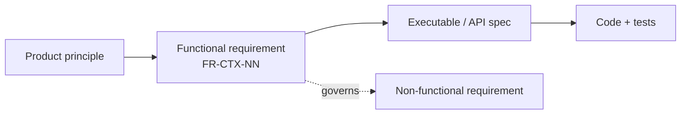

# Functional Requirements Document (FRD)

**What VieGo must do.** Each requirement has a stable ID (`FR-<CTX>-NN`) so specs, designs, tests,
and issues can trace to it. This document is **authoritative for scope**; the exact behaviour of
each requirement is pinned by its linked [executable specification](../executable-specifications/)
and [API contract](../api-system-specifications/). If a requirement and its spec disagree, the
[spec wins](../README.md) — open a change here first, then update the spec.

## How to read this

| Column | Meaning |
|--------|---------|
| **ID** | Stable identifier. Reference it from designs, features, commits, and tickets. |
| **Requirement** | The capability, phrased as a testable statement. |
| **Priority** | `MUST` (launch-blocking) · `SHOULD` (launch target, can slip) · `COULD` (fast-follow). |
| **Spec** | The executable/API spec that pins the behaviour. |
| **Status** | `ready` (behaviour agreed) · `draft` (needs a product decision — see [open decisions](#open-decisions)). |

Requirements are grouped by [bounded context](../../02-authored-system-documentation/software-architecture-document/ddd-and-domain-model.md).
Non-functional requirements (performance, security, accessibility, localization quality, …) live in the
companion [Non-Functional Requirements Document](non-functional-requirements.md).

---

## FR-ID — Identity (Authentication)

Phase [P1](../../../../02-process-documentation/plans-estimates-schedules.md) · Design: [identity](../../02-authored-system-documentation/software-architecture-document/design/identity.md) · Spec: [`authentication.feature`](../executable-specifications/features/identity/authentication.feature)

| ID | Requirement | Priority | Spec | Status |
|----|-------------|----------|------|--------|
| FR-ID-01 | A visitor can sign in with a supported Auth Provider (Email, Google at P1) and become an **Explorer**. | MUST | [authentication.feature](../executable-specifications/features/identity/authentication.feature) | ready |
| FR-ID-02 | An Explorer is **created exactly once** per identity; repeat sign-ins authenticate but never re-register. | MUST | [authentication.feature](../executable-specifications/features/identity/authentication.feature) | ready |
| FR-ID-03 | On first sign-in the system publishes **`ExplorerRegistered`** so other contexts can provision per-Explorer state. | MUST | [domain-events](../api-system-specifications/domain-events.asyncapi.yaml) | ready |
| FR-ID-04 | The backend issues a short-lived **access JWT** and a **refresh token**, and can rotate the access token. | MUST | [rest-api](../api-system-specifications/rest-api.openapi.yaml) | ready |
| FR-ID-05 | An Explorer can set **Preferences** (`language` vi/en, `theme` light/dark); preferences **persist across sessions and devices**. | MUST | [authentication.feature](../executable-specifications/features/identity/authentication.feature) | ready |
| FR-ID-06 | Updating preferences publishes **`PreferencesUpdated`**. | SHOULD | [domain-events](../api-system-specifications/domain-events.asyncapi.yaml) | ready |
| FR-ID-07 | Additional providers **Facebook** and **Zalo** can be used to sign in. | COULD | — | draft |
| FR-ID-08 | Multiple providers for the same person resolve to **one Explorer** (account linking). | COULD | — | draft |

## FR-EX — Exploration (Province unlocking)

Phase [P2](../../../../02-process-documentation/plans-estimates-schedules.md) · Design: [exploration](../../02-authored-system-documentation/software-architecture-document/design/exploration.md) · Spec: [`province-unlocking.feature`](../executable-specifications/features/exploration/province-unlocking.feature)

| ID | Requirement | Priority | Spec | Status |
|----|-------------|----------|------|--------|
| FR-EX-01 | An Explorer can view the interactive **map of Vietnam** with provinces and ward metadata. | MUST | [rest-api](../api-system-specifications/rest-api.openapi.yaml) | ready |
| FR-EX-02 | An Explorer can **unlock** a discovered Province, adding it to their **Collection**. | MUST | [province-unlocking.feature](../executable-specifications/features/exploration/province-unlocking.feature) | ready |
| FR-EX-03 | Unlocking is **idempotent** — a second unlock of the same province is refused (409) and leaves the Collection unchanged. | MUST | [province-unlocking.feature](../executable-specifications/features/exploration/province-unlocking.feature) | ready |
| FR-EX-04 | A successful unlock publishes **`ProvinceUnlocked`** (the backbone event downstream contexts consume). | MUST | [domain-events](../api-system-specifications/domain-events.asyncapi.yaml) | ready |
| FR-EX-05 | An Explorer can view their **Collection** of unlocked provinces. | MUST | [rest-api](../api-system-specifications/rest-api.openapi.yaml) | ready |
| FR-EX-06 | On the map, unlocked provinces are visually distinguished (filled gold) from locked ones. | MUST | [design-system](../../02-authored-system-documentation/ux-design-documentation/design-system.md) | ready |
| FR-EX-07 | An unlock is only permitted when its **unlock condition** is met (proximity / trivia / tap / purchase — TBD). | MUST | [province-unlocking.feature](../executable-specifications/features/exploration/province-unlocking.feature) | draft |

## FR-EN — Engagement (Daily streak)

Phase [P3](../../../../02-process-documentation/plans-estimates-schedules.md) · Design: [engagement](../../02-authored-system-documentation/software-architecture-document/design/engagement.md) · Spec: [`daily-streak.feature`](../executable-specifications/features/engagement/daily-streak.feature)

| ID | Requirement | Priority | Spec | Status |
|----|-------------|----------|------|--------|
| FR-EN-01 | Completing the **Discovery Ritual** advances the Explorer's **Streak** at most **once per calendar day**. | MUST | [daily-streak.feature](../executable-specifications/features/engagement/daily-streak.feature) | ready |
| FR-EN-02 | A **missed day resets** the current streak to 0 and publishes **`StreakBroken`**. | MUST | [daily-streak.feature](../executable-specifications/features/engagement/daily-streak.feature) | ready |
| FR-EN-03 | The recorded **longest streak is monotonic** — it never decreases, even after a reset. | MUST | [daily-streak.feature](../executable-specifications/features/engagement/daily-streak.feature) | ready |
| FR-EN-04 | Advancing the streak publishes **`StreakAdvanced`**. | MUST | [domain-events](../api-system-specifications/domain-events.asyncapi.yaml) | ready |
| FR-EN-05 | A streak breaks even when the Explorer never opens the app (evaluation on read and/or scheduled sweep). | SHOULD | [daily-streak.feature](../executable-specifications/features/engagement/daily-streak.feature) | ready |
| FR-EN-06 | An Explorer can view their **current** and **longest** streak and last ritual date. | MUST | [rest-api](../api-system-specifications/rest-api.openapi.yaml) | ready |
| FR-EN-07 | The **discovery ritual definition** and the **day/timezone boundary** are fixed and applied consistently. | MUST | [daily-streak.feature](../executable-specifications/features/engagement/daily-streak.feature) | draft |

## FR-CO — Content (Heritage access)

Phase [P4](../../../../02-process-documentation/plans-estimates-schedules.md) · Design: [content](../../02-authored-system-documentation/software-architecture-document/design/content.md) · Spec: [`heritage-access.feature`](../executable-specifications/features/content/heritage-access.feature)

| ID | Requirement | Priority | Spec | Status |
|----|-------------|----------|------|--------|
| FR-CO-01 | An Explorer can access a province's **Regional Heritage** — **Cultural Beats** (audio) and **Trivia** — for provinces they have **unlocked**. | MUST | [heritage-access.feature](../executable-specifications/features/content/heritage-access.feature) | ready |
| FR-CO-02 | Heritage for a **locked** province is **gated** — access is refused (403) with a prompt to unlock; never a partial read. | MUST | [heritage-access.feature](../executable-specifications/features/content/heritage-access.feature) | ready |
| FR-CO-03 | A **`HeritageAccess` grant** is created automatically when a province is unlocked (consumes `ProvinceUnlocked`). | MUST | [heritage-access.feature](../executable-specifications/features/content/heritage-access.feature) | ready |
| FR-CO-04 | Beat audio is delivered via a **short-lived signed/CDN URL**, not raw bytes; access respects the unlock entitlement. | MUST | [rest-api](../api-system-specifications/rest-api.openapi.yaml) | ready |
| FR-CO-05 | Heritage renders in the Explorer's **preferred language** (VI/EN) via `LocalizedText`. | MUST | [heritage-access.feature](../executable-specifications/features/content/heritage-access.feature) | ready |

## FR-CC — Cross-cutting

Applies across contexts; see also the [Non-Functional Requirements](non-functional-requirements.md) for how well these must perform.

| ID | Requirement | Priority | Spec | Status |
|----|-------------|----------|------|--------|
| FR-CC-01 | Every user-facing string is available in **Vietnamese and English**; the active locale drives all content and copy. | MUST | [localization](../../02-authored-system-documentation/ux-design-documentation/localization.md) | ready |
| FR-CC-02 | The app supports **light and dark themes**, switchable and persisted via preferences. | MUST | [design-system](../../02-authored-system-documentation/ux-design-documentation/design-system.md) | ready |
| FR-CC-03 | An Explorer can only access **their own** (`me`-scoped) resources. | MUST | [security](../../04-user-documentation/system-admin-documentation/security.md) | ready |
| FR-CC-04 | API errors are returned as **RFC 9457 Problem Details** and mapped to typed client errors. | MUST | [rest-api](../api-system-specifications/rest-api.openapi.yaml) | ready |

---

## Traceability

Each requirement traces **down** to a behaviour (executable spec / API operation) and **up** to a
product driver. The chain is:

- **Designs** cite the FR IDs they realise (see each module design's *Requirements* line).
- **Feature files** map scenarios to FR IDs via tags/comments.
- **Non-functional** constraints on these behaviours live in the [NFRD](non-functional-requirements.md).

## Open decisions

`draft` requirements are blocked on product decisions. They are tracked in the module designs and the
[plans & schedules](../../../../02-process-documentation/plans-estimates-schedules.md):

| Requirement | Decision needed | Owner | Needed by |
|-------------|-----------------|-------|-----------|
| FR-EX-07 | Which **unlock condition** (proximity / trivia / tap / purchase). | Product | P2 |
| FR-EN-07 | **Discovery ritual** definition + **day/timezone** rule. | Product | P3 |
| FR-ID-07 | Add **Facebook + Zalo** providers. | Product | P5 (fast-follow) |
| FR-ID-08 | Cross-provider **account linking**. | Product | P5 |
