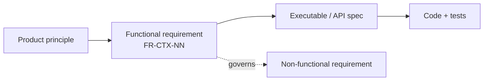

# Functional Requirements Document (FRD)

**What VieGo must do.** Each requirement has a stable ID (`FR-<CTX>-NN`) so specs, designs, tests,
and issues can trace to it. This document is **authoritative for scope**; the exact behaviour of
each requirement is pinned by its linked [executable specification](../executable-specifications/)
and [API contract](../api-system-specifications/). If a requirement and its spec disagree, the
[spec wins](../README.md) — open a change here first, then update the spec.

VieGo is a **social capture** app: the central act is capturing a **Beat** (a photo check-in), and
one capture drives the streak, the province unlock, and the friend/discover feeds at once.

## How to read this

| Column | Meaning |
|--------|---------|
| **ID** | Stable identifier. Reference it from designs, features, commits, and tickets. |
| **Requirement** | The capability, phrased as a testable statement. |
| **Priority** | `MUST` (launch-blocking) · `SHOULD` (launch target, can slip) · `COULD` (fast-follow). |
| **Spec** | The executable/API spec that pins the behaviour. |
| **Status** | `ready` (behaviour agreed) · `draft` (needs a product decision — see [open decisions](#open-decisions)). |

Requirements are grouped by [bounded context](../../02-authored-system-documentation/software-architecture-document/ddd-and-domain-model.md).
Non-functional requirements (performance, security, accessibility, localization quality, …) live in the
companion [Non-Functional Requirements Document](non-functional-requirements.md).

---

## FR-ID — Identity (Authentication)

Phase [P1](../../../../02-process-documentation/plans-estimates-schedules.md) · Design: [identity](../../02-authored-system-documentation/software-architecture-document/design/identity.md) · Spec: [`authentication.feature`](../executable-specifications/features/identity/authentication.feature)

| ID | Requirement | Priority | Spec | Status |
|----|-------------|----------|------|--------|
| FR-ID-01 | A visitor can sign in with a supported Auth Provider (Email, Google at P1) and become an **Explorer**. | MUST | [authentication.feature](../executable-specifications/features/identity/authentication.feature) | ready |
| FR-ID-02 | An Explorer is **created exactly once** per identity; repeat sign-ins authenticate but never re-register. | MUST | [authentication.feature](../executable-specifications/features/identity/authentication.feature) | ready |
| FR-ID-03 | Each Explorer has a **unique handle** (`@name`) used in invite links and mentions. | MUST | [authentication.feature](../executable-specifications/features/identity/authentication.feature) | ready |
| FR-ID-04 | On first sign-in the system publishes **`ExplorerRegistered`** so other contexts can provision per-Explorer state. | MUST | [domain-events](../api-system-specifications/domain-events.asyncapi.yaml) | ready |
| FR-ID-05 | The backend issues a short-lived **access JWT** and a **refresh token**, and can rotate the access token. | MUST | [rest-api](../api-system-specifications/rest-api.openapi.yaml) | ready |
| FR-ID-06 | An Explorer can set **Preferences** (`language` vi/en/…, `theme` light/dark); preferences **persist across sessions and devices**. | MUST | [authentication.feature](../executable-specifications/features/identity/authentication.feature) | ready |
| FR-ID-07 | Updating preferences publishes **`PreferencesUpdated`**. | SHOULD | [domain-events](../api-system-specifications/domain-events.asyncapi.yaml) | ready |
| FR-ID-08 | Additional providers **Facebook** and **Zalo** can be used to sign in. | COULD | — | draft |
| FR-ID-09 | Multiple providers for the same person resolve to **one Explorer** (account linking). | COULD | — | draft |

## FR-EX — Exploration (Map, places & province unlocking)

Phase [P2](../../../../02-process-documentation/plans-estimates-schedules.md) · Design: [exploration](../../02-authored-system-documentation/software-architecture-document/design/exploration.md) · Spec: [`province-unlocking.feature`](../executable-specifications/features/exploration/province-unlocking.feature)

| ID | Requirement | Priority | Spec | Status |
|----|-------------|----------|------|--------|
| FR-EX-01 | An Explorer can view the interactive **map of Vietnam** with provinces, ward metadata, and per-province **public check-in heat**. | MUST | [rest-api](../api-system-specifications/rest-api.openapi.yaml) | ready |
| FR-EX-02 | Capturing an Explorer's **first Beat in a province unlocks it**, adding it to their **Collection** (consumes `BeatCaptured`). | MUST | [province-unlocking.feature](../executable-specifications/features/exploration/province-unlocking.feature) | ready |
| FR-EX-03 | Unlocking is **idempotent** — a subsequent Beat in an already-unlocked province leaves the Collection unchanged. | MUST | [province-unlocking.feature](../executable-specifications/features/exploration/province-unlocking.feature) | ready |
| FR-EX-04 | A successful unlock publishes **`ProvinceUnlocked`**. | MUST | [domain-events](../api-system-specifications/domain-events.asyncapi.yaml) | ready |
| FR-EX-05 | An Explorer can view their **Collection** of unlocked provinces (e.g. "9 / 34 provinces unlocked"). | MUST | [rest-api](../api-system-specifications/rest-api.openapi.yaml) | ready |
| FR-EX-06 | On the map, unlocked provinces are visually distinguished (filled gold) from locked ones, and heat shades provinces by public check-in volume. | MUST | [design-system](../../02-authored-system-documentation/ui-ux-design-document/design-system.md) | ready |
| FR-EX-07 | An Explorer can open a **Place** (POI) to see its local context — description ("why it matters"), hours, cost, local tip, rating, category, community Beats, and reviews. | MUST | [rest-api](../api-system-specifications/rest-api.openapi.yaml) | ready |
| FR-EX-08 | An Explorer can **search** across provinces, places, and dishes, and filter places by **category** (coffee/food/heritage/nightlife/nature/hidden gems). | MUST | [rest-api](../api-system-specifications/rest-api.openapi.yaml) | ready |
| FR-EX-09 | Precise location is used **only inside Vietnam**; outside Vietnam the Explorer's live position is **hidden** and Beats are not pinned to a precise point. | MUST | [security](../../04-user-documentation/system-admin-documentation/security.md) | ready |

## FR-CO — Content (Beats, reviews & memories)

Phase [P3](../../../../02-process-documentation/plans-estimates-schedules.md) · Design: [content](../../02-authored-system-documentation/software-architecture-document/design/content.md) · Spec: [`beat-capture.feature`](../executable-specifications/features/content/beat-capture.feature)

| ID | Requirement | Priority | Spec | Status |
|----|-------------|----------|------|--------|
| FR-CO-01 | An Explorer can **capture a Beat** (photo) with the in-app camera; the Beat is **auto-tagged** with the current Place and Province. | MUST | [beat-capture.feature](../executable-specifications/features/content/beat-capture.feature) | ready |
| FR-CO-02 | On capture, the Explorer chooses an **audience** — **Friends** (a chosen recipient list) or **Public** — and may add an optional **caption**. | MUST | [beat-capture.feature](../executable-specifications/features/content/beat-capture.feature) | ready |
| FR-CO-03 | Capturing a Beat publishes **`BeatCaptured`** — the backbone event consumed by Exploration (unlock), Engagement (streak), and Social (feeds). | MUST | [domain-events](../api-system-specifications/domain-events.asyncapi.yaml) | ready |
| FR-CO-04 | A Beat is **immutable** once captured (photo, place, province, timestamp, audience). | MUST | [beat-capture.feature](../executable-specifications/features/content/beat-capture.feature) | ready |
| FR-CO-05 | Beat photos are delivered via a **short-lived signed/CDN URL**, not raw bytes; access respects the Beat's audience. | MUST | [rest-api](../api-system-specifications/rest-api.openapi.yaml) | ready |
| FR-CO-06 | An Explorer can view their **Memories** — their own Beats, time-ordered by month. | MUST | [rest-api](../api-system-specifications/rest-api.openapi.yaml) | ready |
| FR-CO-07 | An Explorer can leave a **Review** on a Place **only if** they have captured a Beat there ("verified by location"). | SHOULD | [beat-capture.feature](../executable-specifications/features/content/beat-capture.feature) | draft |

## FR-EN — Engagement (Streaks, milestones & notifications)

Phase [P4](../../../../02-process-documentation/plans-estimates-schedules.md) · Design: [engagement](../../02-authored-system-documentation/software-architecture-document/design/engagement.md) · Spec: [`daily-streak.feature`](../executable-specifications/features/engagement/daily-streak.feature)

| ID | Requirement | Priority | Spec | Status |
|----|-------------|----------|------|--------|
| FR-EN-01 | **Capturing at least one Beat** advances the Explorer's **Streak** at most **once per calendar day** (consumes `BeatCaptured`). | MUST | [daily-streak.feature](../executable-specifications/features/engagement/daily-streak.feature) | ready |
| FR-EN-02 | A **missed day resets** the current streak to 0 and publishes **`StreakBroken`**. | MUST | [daily-streak.feature](../executable-specifications/features/engagement/daily-streak.feature) | ready |
| FR-EN-03 | The recorded **longest streak is monotonic** — it never decreases, even after a reset. | MUST | [daily-streak.feature](../executable-specifications/features/engagement/daily-streak.feature) | ready |
| FR-EN-04 | Advancing the streak publishes **`StreakAdvanced`**. | MUST | [domain-events](../api-system-specifications/domain-events.asyncapi.yaml) | ready |
| FR-EN-05 | A streak breaks even when the Explorer never opens the app (evaluation on read and/or scheduled sweep). | SHOULD | [daily-streak.feature](../executable-specifications/features/engagement/daily-streak.feature) | ready |
| FR-EN-06 | An Explorer can view their **current** and **longest** streak, last capture date, and a **this-week** view. | MUST | [rest-api](../api-system-specifications/rest-api.openapi.yaml) | ready |
| FR-EN-07 | Reaching a streak **milestone** (e.g. 7 days) awards a **Badge**, publishes **`MilestoneReached`**, and surfaces a celebration. | SHOULD | [daily-streak.feature](../executable-specifications/features/engagement/daily-streak.feature) | ready |
| FR-EN-08 | An Explorer receives **notifications**: streak reminder, a like on their Beat, a friend's Beat, a milestone, and new places nearby. | SHOULD | [rest-api](../api-system-specifications/rest-api.openapi.yaml) | ready |
| FR-EN-09 | The **day/timezone boundary** for "a day" is fixed and applied consistently. | MUST | [daily-streak.feature](../executable-specifications/features/engagement/daily-streak.feature) | draft |

## FR-SO — Social (Friends, feeds & reactions)

Phase [P5](../../../../02-process-documentation/plans-estimates-schedules.md) · Design: [social](../../02-authored-system-documentation/software-architecture-document/design/social.md) · Spec: [`social-feed.feature`](../executable-specifications/features/social/social-feed.feature)

| ID | Requirement | Priority | Spec | Status |
|----|-------------|----------|------|--------|
| FR-SO-01 | An Explorer can view a **friend feed** — Beats whose audience includes them, freshest first. | MUST | [social-feed.feature](../executable-specifications/features/social/social-feed.feature) | ready |
| FR-SO-02 | An Explorer can view a **Discover** feed of **public** Beats from other travellers. | MUST | [social-feed.feature](../executable-specifications/features/social/social-feed.feature) | ready |
| FR-SO-03 | An Explorer can **add a friend** via an **invite link** (`viego.app/add/@handle`) or **QR code**. | MUST | [social-feed.feature](../executable-specifications/features/social/social-feed.feature) | ready |
| FR-SO-04 | Establishing a friendship publishes **`FriendAdded`**. | SHOULD | [domain-events](../api-system-specifications/domain-events.asyncapi.yaml) | ready |
| FR-SO-05 | An Explorer can **react** to a Beat (like/heart, bolt); reacting publishes **`BeatReacted`**. | SHOULD | [social-feed.feature](../executable-specifications/features/social/social-feed.feature) | ready |
| FR-SO-06 | A **public** Beat appears on its Place and Province as **social proof**; a Beat from a friend is marked with a **Friend** badge. | MUST | [social-feed.feature](../executable-specifications/features/social/social-feed.feature) | ready |
| FR-SO-07 | An Explorer can **share their invite link** via copy, Zalo, Facebook, the system share sheet, or QR. | SHOULD | [rest-api](../api-system-specifications/rest-api.openapi.yaml) | ready |

## FR-CC — Cross-cutting

Applies across contexts; see also the [Non-Functional Requirements](non-functional-requirements.md) for how well these must perform.

| ID | Requirement | Priority | Spec | Status |
|----|-------------|----------|------|--------|
| FR-CC-01 | Every user-facing string is available in **Vietnamese and English** (with **Korean, Japanese, French** as additional selectable locales); the active locale drives all content and copy. | MUST | [localization](../../02-authored-system-documentation/ui-ux-design-document/localization.md) | ready |
| FR-CC-02 | The app supports **light and dark themes**, switchable and persisted via preferences. | MUST | [design-system](../../02-authored-system-documentation/ui-ux-design-document/design-system.md) | ready |
| FR-CC-03 | An Explorer can only access **their own** (`me`-scoped) resources; a Beat is visible only to its audience. | MUST | [security](../../04-user-documentation/system-admin-documentation/security.md) | ready |
| FR-CC-04 | API errors are returned as **RFC 9457 Problem Details** and mapped to typed client errors. | MUST | [rest-api](../api-system-specifications/rest-api.openapi.yaml) | ready |

---

## Traceability

Each requirement traces **down** to a behaviour (executable spec / API operation) and **up** to a
product driver. The chain is:

- **Designs** cite the FR IDs they realise (see each module design's *Requirements* line).
- **Feature files** map scenarios to FR IDs via tags/comments.
- **Non-functional** constraints on these behaviours live in the [NFRD](non-functional-requirements.md).

## Open decisions

`draft` requirements are blocked on product decisions. They are tracked in the module designs and the
[plans & schedules](../../../../02-process-documentation/plans-estimates-schedules.md):

| Requirement | Decision needed | Owner | Needed by |
|-------------|-----------------|-------|-----------|
| FR-EN-09 | **Day/timezone** rule for streak day boundary. | Product | P4 |
| FR-CO-07 | Exact **Review** eligibility + moderation rules. | Product | P3 |
| FR-ID-08 | Add **Facebook + Zalo** providers. | Product | P5 (fast-follow) |
| FR-ID-09 | Cross-provider **account linking**. | Product | P5 |

> **Resolved from the prototype:** the province **unlock condition** is *"capture your first Beat in
> the province"* (FR-EX-02), and the **daily ritual** is *"capture at least one Beat"* (FR-EN-01) —
> both previously open decisions.
