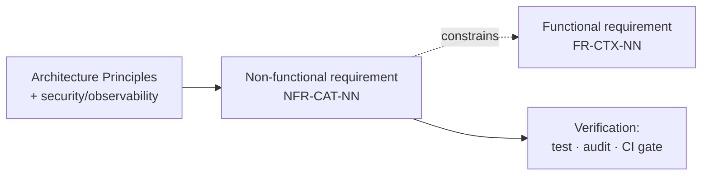

# Non-Functional Requirements Document (NFRD)

**How well VieGo must behave.** Where the [Functional Requirements](functional-requirements.md)
say *what* the system does, these say *how well* — the quality attributes and constraints that every
functional requirement is measured against. Each has a stable ID (`NFR-<CAT>-NN`).

Most of these derive from the
[Architecture Principles](../../02-authored-system-documentation/software-architecture-document/architecture-principles.md)
(non-negotiables) and the [security](../../04-user-documentation/system-admin-documentation/security.md)
and [observability](../../04-user-documentation/system-admin-documentation/observability.md) docs —
this document makes them **measurable and traceable**. Rationale for architecture-level choices lives in
the [ADRs](../../02-authored-system-documentation/software-architecture-document/decisions/); the
principles are the source of the constraint, this document is the acceptance bar.

## How to read this

| Column | Meaning |
|--------|---------|
| **ID** | Stable identifier (`NFR-<CAT>-NN`). |
| **Requirement** | The quality attribute, phrased so it can be verified. |
| **Priority** | `MUST` · `SHOULD` · `COULD`. |
| **Verify** | How compliance is checked (test, audit, CI gate, review). |

Applies to the functional scope in the [FRD](functional-requirements.md); reference specific
`FR-*` IDs where a constraint is scoped to one behaviour.

---

## NFR-UX — Usability & Accessibility

Source: [Architecture Principles → Product & UX non-negotiables](../../02-authored-system-documentation/software-architecture-document/architecture-principles.md) · [UX design](../../02-authored-system-documentation/ui-ux-design-document/)

| ID | Requirement | Priority | Verify |
|----|-------------|----------|--------|
| NFR-UX-01 | **Mobile-first & adaptive**: designed at the mobile viewport (~402×874) first; usable single-handed. | MUST | Design review · device testing |
| NFR-UX-02 | **Contrast**: text and UI meet high-contrast targets in **both** light and dark themes. | MUST | Accessibility audit (P5) |
| NFR-UX-03 | **Touch targets** are **≥ 44px**. | MUST | Accessibility audit · lint |
| NFR-UX-04 | Motion (unlock celebration, streak counter) respects the OS **reduced-motion** setting. | MUST | Manual + automated check |
| NFR-UX-05 | **Design tokens are law** — no hard-coded colours/typography outside the token set. | MUST | Code review · lint |

## NFR-I18N — Localization

Source: [localization](../../02-authored-system-documentation/ui-ux-design-document/localization.md) · realises [FR-CC-01](functional-requirements.md#fr-cc--cross-cutting)

| ID | Requirement | Priority | Verify |
|----|-------------|----------|--------|
| NFR-I18N-01 | **VI/EN parity**: no feature ships with Vietnamese or English missing; nothing hard-coded. | MUST | VI/EN parity audit (P5) |
| NFR-I18N-02 | Server honours **`Accept-Language`**; `LocalizedText` resolves per the active locale. | MUST | API test |
| NFR-I18N-03 | Locale/theme switching is **instant** and applies without a restart. | SHOULD | Manual test |

## NFR-PERF — Performance

Source: [infrastructure](../../02-authored-system-documentation/software-architecture-document/infrastructure.md) · map-render [risk](../../../../02-process-documentation/plans-estimates-schedules.md)

| ID | Requirement | Priority | Verify |
|----|-------------|----------|--------|
| NFR-PERF-01 | The **map renders smoothly on low-end devices** (target ~60fps interaction; profile early, simplify/virtualize SVG). | MUST | Profiling on target devices |
| NFR-PERF-02 | Interactive read endpoints (map, collection, streak, place, feeds) respond within a target latency budget (**p95 ≤ 500ms** server-side, excl. network); hot, slow-changing reads are served from the **Redis cache** ([ADR 0007](../../02-authored-system-documentation/software-architecture-document/decisions/0007-redis-cache-and-token-rotation.md)). | SHOULD | Load test · APM |
| NFR-PERF-03 | Beat **photos** load via a **signed/CDN URL**; media is never proxied through the app server. | MUST | Design review · [FR-CO-05](functional-requirements.md#fr-co--content-beats-reviews--memories) |
| NFR-PERF-04 | The **capture → Beat sent** path feels instant: the confirmation ("Beat sent!") is shown optimistically while upload and fan-out complete asynchronously. | SHOULD | Manual test · APM |

## NFR-SEC — Security & Privacy

Source: [security](../../04-user-documentation/system-admin-documentation/security.md) · [Architecture Principles → Secure by default](../../02-authored-system-documentation/software-architecture-document/architecture-principles.md)

| ID | Requirement | Priority | Verify |
|----|-------------|----------|--------|
| NFR-SEC-01 | **Auth on every non-public endpoint**; Spring Security enforces Bearer JWT. | MUST | Integration test · review |
| NFR-SEC-02 | **`me`-scoping**: an Explorer can only reach their own resources. | MUST | Integration test · [FR-CC-03](functional-requirements.md#fr-cc--cross-cutting) |
| NFR-SEC-03 | **No secrets in source or images**; secrets via manager/env injection, rotated per environment. | MUST | Secret scanning in [CI](../../04-user-documentation/system-admin-documentation/ci-cd.md) |
| NFR-SEC-04 | VieGo stores **no passwords** — OIDC relying party; only provider subject refs + rotating refresh handles. | MUST | Design review · schema audit |
| NFR-SEC-05 | **TLS everywhere** (HTTPS, DB in transit); sensitive data encrypted at rest. | MUST | Config audit |
| NFR-SEC-06 | **No PII in logs or URLs**; input validated at the API boundary; errors leak no internals. | MUST | Code review · log audit |
| NFR-SEC-07 | **Rate limiting** on auth and capture endpoints. | SHOULD | Config · load test |
| NFR-SEC-08 | Dependency & container **scanning** runs in CI. | MUST | [CI](../../04-user-documentation/system-admin-documentation/ci-cd.md) gate |
| NFR-SEC-09 | **Location privacy**: precise location is captured/shown **only inside Vietnam**; outside Vietnam it is suppressed. A Beat is served **only to its audience** (Friends list or Public). | MUST | Integration test · [FR-EX-09](functional-requirements.md#fr-ex--exploration-map-places--province-unlocking) · [FR-CC-03](functional-requirements.md#fr-cc--cross-cutting) |

## NFR-REL — Reliability & Data integrity

Source: module designs · [Architecture Principles → Backend non-negotiables](../../02-authored-system-documentation/software-architecture-document/architecture-principles.md)

| ID | Requirement | Priority | Verify |
|----|-------------|----------|--------|
| NFR-REL-01 | State-changing operations that emit events do so **transactionally** with the state change (event log, same tx). | MUST | `@ApplicationModuleTest` |
| NFR-REL-02 | Event consumers are **idempotent** — reprocessing an event causes no duplicate side effects (e.g. a re-delivered `BeatCaptured` advances the streak and unlocks the province at most once). | MUST | Module integration test |
| NFR-REL-04 | The **cache is non-authoritative** — a Redis miss or outage falls back to Postgres; reads stay correct (only slower), and gating/entitlement checks always hit the source of truth. | MUST | Failover test · [ADR 0007](../../02-authored-system-documentation/software-architecture-document/decisions/0007-redis-cache-and-token-rotation.md) |
| NFR-REL-03 | Idempotent commands (unlock, daily ritual) are **safe to retry** — matches offline queue/reconcile behaviour. | MUST | Contract test · [FR-EX-03](functional-requirements.md#fr-ex--exploration-province-unlocking) |

## NFR-MOD — Modularity & Maintainability

Source: [Architecture Principles → Backend non-negotiables](../../02-authored-system-documentation/software-architecture-document/architecture-principles.md) · [module boundary rules](../../../../02-process-documentation/sdd-standards/module-boundary-rules.md)

| ID | Requirement | Priority | Verify |
|----|-------------|----------|--------|
| NFR-MOD-01 | Each module **owns its schema**; **no cross-module FKs/joins** — peers referenced by **id only**. | MUST | Review · `ApplicationModules.verify()` |
| NFR-MOD-02 | Modules integrate **via published events or named-interface APIs** — never internal packages. | MUST | `ApplicationModules.verify()` in CI |
| NFR-MOD-03 | Every module is **extraction-ready** — liftable into a service without redesign. | MUST | [Playbook](../../02-authored-system-documentation/software-architecture-document/service-extraction-playbook.md) · CI |
| NFR-MOD-04 | The **API contract (OpenAPI) is the boundary**; breaking changes are **versioned** — released mobile clients keep working. | MUST | Contract diff in CI |

## NFR-OBS — Observability

Source: [observability](../../04-user-documentation/system-admin-documentation/observability.md) · [Architecture Principles → Observable by default](../../02-authored-system-documentation/software-architecture-document/architecture-principles.md)

| ID | Requirement | Priority | Verify |
|----|-------------|----------|--------|
| NFR-OBS-01 | **Structured logs, metrics, and traces** are emitted across the system. | MUST | Observability review |
| NFR-OBS-02 | Every request/event carries a **correlation/trace id** end-to-end. | SHOULD | Trace inspection |

## NFR-QA — Testability & Quality

Source: [test strategy](../../../../02-process-documentation/test-strategy.md) · [Architecture Principles → Tested at the right altitude](../../02-authored-system-documentation/software-architecture-document/architecture-principles.md)

| ID | Requirement | Priority | Verify |
|----|-------------|----------|--------|
| NFR-QA-01 | Behaviour is **tested at the right altitude**: domain unit tests, `@ApplicationModuleTest` per module, critical flows end-to-end. | MUST | CI |
| NFR-QA-02 | Every `ready` functional requirement is covered by at least one **executable specification** scenario. | MUST | Coverage review |

---

## Traceability

NFRs **constrain** the functional scope rather than adding features — a given `FR-*` must satisfy the
NFRs in its area (e.g. [FR-EX-01](functional-requirements.md#fr-ex--exploration-province-unlocking) map
rendering is bound by [NFR-PERF-01](#nfr-perf--performance)). Where a constraint applies to one behaviour,
the row links the specific `FR-*` id.
