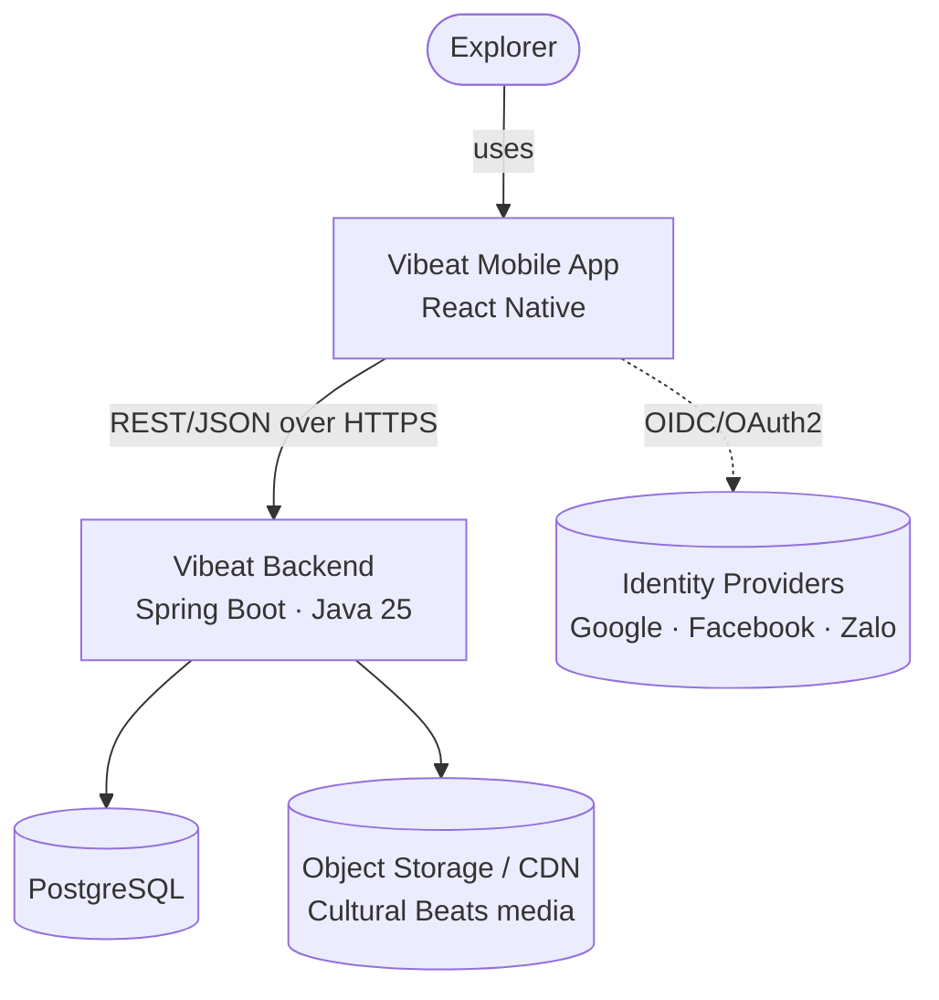

# Software Architecture Document (SAD)

The authoritative description of **how Vibeat is built**. A React Native app talks to a Spring
Boot (Java 25) backend built as a **modular monolith** (Spring Modulith) whose modules map 1:1
to DDD [bounded contexts](ddd-and-domain-model.md) and are designed for future extraction into
services.

## Sections
| Doc | Covers |
|-----|--------|
| [Architecture Principles](architecture-principles.md) | Non-negotiable rules governing all design & code |
| [DDD & Domain Model](ddd-and-domain-model.md) | Ubiquitous language, context map, aggregates, the four bounded contexts |
| [Backend — Modular Monolith](backend-modular-monolith.md) | Spring Modulith module structure, events, persistence |
| [Service Extraction Playbook](service-extraction-playbook.md) | Turning a module into a standalone service |
| [Frontend Architecture](frontend-architecture.md) | React Native app structure, data/state, navigation |
| [Detailed Design (per module)](design/) | Low-level design for each module / core feature, mapped to delivery phases |
| [Infrastructure](infrastructure.md) | Deployment topology & environments |
| [Decisions (ADRs)](decisions/) | Recorded architecture decisions |

## Technology stack

| Area | Choice | ADR |
|------|--------|-----|
| Backend language | Java 25 (LTS) | [0004](decisions/0004-java-and-spring-boot.md) |
| Backend framework | Spring Boot 3.x | [0004](decisions/0004-java-and-spring-boot.md) |
| Backend architecture | Modular monolith · Spring Modulith | [0002](decisions/0002-modular-monolith-with-spring-modulith.md) |
| Build | Maven (backend) · npm/EAS (mobile) | — |
| Source control | Single monorepo, path-scoped CI | [0006](decisions/0006-monorepo-source-control.md) |
| Datastore | PostgreSQL, schema-per-module | [0005](decisions/0005-postgresql-and-event-driven-integration.md) |
| Module integration | Domain events (transactional outbox) → broker on extraction | [0002](decisions/0002-modular-monolith-with-spring-modulith.md) / [0005](decisions/0005-postgresql-and-event-driven-integration.md) |
| Mobile | React Native + TypeScript (iOS/Android) | [0003](decisions/0003-react-native-for-mobile.md) |
| API | REST + OpenAPI; async events + AsyncAPI | — |

## C4 Level 1 — System context

## C4 Level 2 — Containers

| Container | Tech | Responsibility |
|-----------|------|----------------|
| Mobile App | React Native (TS) | Map, unlocking, streaks, content playback, theming, i18n |
| Backend API | Spring Boot · Java 25 · Spring Modulith | Domain logic across four modules; REST API; event log |
| PostgreSQL | Postgres | Persistence, schema-per-module |
| Object storage/CDN | TBD | Cultural Beats audio/images |
| Identity Providers | External | Auth (Google, Facebook, Zalo, email) |

## C4 Level 3 — Backend modules

See [Backend — Modular Monolith](backend-modular-monolith.md) for the module topology and the
[DDD model](ddd-and-domain-model.md) for the contexts these modules implement.
