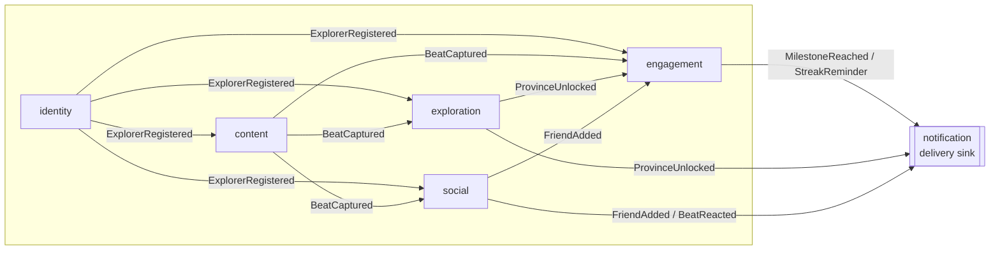

# Backend — Modular Monolith (Spring Modulith)

One Spring Boot application; each [bounded context](ddd-and-domain-model.md) is one **application
module**, built to be [extracted into a service](service-extraction-playbook.md) later
([ADR-0002](decisions/0002-modular-monolith-with-spring-modulith.md)).

## Module topology

```
com.viego
├── VieGoApplication.java
├── shared/        ← open kernel: ids, LocalizedText (no business logic)
├── identity/      ← Explorer accounts, handles, auth, preferences
├── exploration/   ← map, provinces, places (POIs), unlocking, collection, search
├── content/       ← beats (photo check-ins), reviews, memories, media
├── engagement/    ← streaks, milestones/badges
├── social/        ← friendships, invite links, feeds, reactions
└── notification/  ← the delivery sink: notifications + device tokens (push)
```

- **`shared`** is an **open** module (`@ApplicationModule(type = OPEN)`): anyone may depend on it.
- All other modules are **closed**: internals invisible to peers.

## Package skeleton (per module)

```
com.viego.exploration
├── package-info.java          ← @ApplicationModule(displayName = "Exploration")
├── api/                       ← PUBLISHED (named interface "api")
│   ├── package-info.java      ← @NamedInterface("api")
│   ├── ExplorationApi.java    ← use-case facade peers may call (rarely)
│   ├── dto/                   ← DTOs crossing the boundary
│   └── events/                ← published integration events (ProvinceUnlocked)
├── domain/                    ← INTERNAL: aggregates, entities, VOs, domain events, ports
│   ├── Collection.java        ← aggregate root
│   ├── Province.java
│   └── CollectionRepository.java  ← port (interface)
├── application/               ← INTERNAL: use cases / app services
│   └── UnlockProvinceService.java
└── infrastructure/            ← INTERNAL: adapters
    ├── web/         ProvinceController.java
    ├── persistence/ JpaCollectionRepository.java, CollectionEntity.java
    └── listener/    ExplorerRegisteredListener.java
```

## Layers & allowed dependencies

| Layer | Package | Depends on |
|-------|---------|------------|
| API | `<module>.api` | domain (via DTO mapping) |
| Domain | `<module>.domain` | `shared` only |
| Application | `<module>.application` | domain |
| Infrastructure | `<module>.infrastructure` | application, domain |

Dependencies point **inward**. Any module may depend on `shared`; cross-module access is only via
another module's `::api` (discouraged) — prefer events.

## Exposing an API (named interfaces)

Only a module's root + `api` package are visible to peers; everything else is internal.

```java
// exploration/api/package-info.java
@org.springframework.modulith.NamedInterface("api")
package com.viego.exploration.api;
```

## Event-driven integration

Modules integrate through **domain events** — the backbone of loose coupling now and extraction
later. Catalog: [AsyncAPI spec](../../../01-core-specifications/api-system-specifications/domain-events.asyncapi.yaml).

```java
// publish (content.application) — recorded in the transactional event log
events.publishEvent(new BeatCaptured(beatId, explorerId, provinceId, placeId, audience, Instant.now()));

// consume (engagement.infrastructure.listener) — async, transactional, retried
@ApplicationModuleListener
void on(BeatCaptured e) { streaks.advanceFor(e.explorerId(), e.at()); }
```

`BeatCaptured` is the backbone: `exploration` (unlock the province of the first Beat), `engagement`
(advance the daily streak), and `social` (fan out to friend feeds / discover) each consume it.

Rules: events are immutable records in `api/events`, past-tense, carrying **ids/primitives only**.

## How the modules communicate

Two mechanisms only, and the choice between them is not stylistic:

| Mechanism | When | Coupling | Example |
|-----------|------|----------|---------|
| **Domain event** (default) | Something *happened* and one or more peers react to it | Publisher knows nothing about consumers; async, transactional, retried | `BeatCaptured` → unlock, streak, feed, — |
| **`::api` call** (rare) | A synchronous read the caller needs *right now* to serve its own request | Caller names the callee; still no access to internals | reading a peer's projection on the request path |

The **direction of the dependency arrow is a design decision**. A module that only ever *reacts* to
the rest of the system — like `notification` — has arrows pointing **into** it and none pointing
out, which is exactly what stops "tell the user" from leaking into every other context. Each module
declares its allowed peers explicitly, and `ApplicationModules.verify()` fails the build on any edge
not drawn here:



- **`identity`** is the upstream supplier: it publishes `ExplorerRegistered` / `PreferencesUpdated`
  and consumes nothing.
- **`content`** owns the backbone. `BeatCaptured` is the one event three modules hang off, so its
  contract is frozen before its consumers are built ([design](design/content.md)).
- **`notification`** is a pure **fan-in sink** — every arrow points at it. It depends on the
  publishing modules' `::api` events but **no module depends on it**, so nothing else has to know
  how (or whether) the Explorer is told. Peers publish *what happened*; `notification` alone decides
  what becomes a notification and which channel delivers it ([design](design/notification.md)).

Every published integration event lives in the
[AsyncAPI catalog](../../../01-core-specifications/api-system-specifications/domain-events.asyncapi.yaml);
the [context map](ddd-and-domain-model.md#context-map) is the domain-level view of the same edges.

## Request flow — capture a Beat

```
POST /api/v1/beats
  → content.infrastructure.web.BeatController
  → content.application.CaptureBeatService (tx)
      → Beat aggregate enforces invariants (immutable, resolved province)
      → publishes BeatCaptured (recorded in event log, same tx)
  → exploration listener unlocks the province (first Beat there)   (separate tx, async)
  → engagement listener advances the Streak                        (separate tx, async)
  → social listener fans the Beat out to friend feeds / discover   (separate tx, async)
```

A second hop shows why `notification` is its own module: when `engagement` crosses a milestone it
publishes `MilestoneReached`, which `notification` turns into a notification — `content` and
`engagement` never learn that a notification exists.

```
BeatCaptured → engagement advances the Streak → crosses milestone
  → engagement publishes MilestoneReached                          (event log, same tx)
  → notification listener records a Notification + emits NotificationRaised  (separate tx, async)
  → push adapter delivers to the recipient's device tokens         (separate tx, async)
```

## Persistence & data ownership

- **One schema per module** (`identity`, `exploration`, `content`, `engagement`, `social`,
  `notification`).
- **No cross-module foreign keys or joins.** Reference peers by id value.
- **One key type: UUIDv7**, generated by the application in the shared `BaseEntity`
  ([ADR 0014](decisions/0014-uuidv7-primary-keys.md)). Because a peer is referenced by raw id
  value, a single key type across every schema is what makes those references unambiguous.
  Geography (`provinces`, `wards`) keeps its natural ISO codes.
- Domain talks to **ports**; JPA lives only in `infrastructure.persistence`.
- **Flyway per module:**
  ```
  db/migration/{identity,exploration,content,engagement,social,notification}/V1__*.sql
  ```
- **Event-publication log** (Spring Modulith JPA outbox) guarantees at-least-once delivery.
- **Cross-context reads:** maintain a local projection from events (preferred) or call the
  owning module's `api`. Example: the `social` friend-feed projection is built from `BeatCaptured`;
  a profile view subscribes to `StreakAdvanced` + `ProvinceUnlocked`.
- **Redis cache/token store** ([ADR 0007](decisions/0007-redis-cache-and-token-rotation.md)) is
  **partitioned by module** the same way — each module uses its own key namespace (`identity:*`,
  `exploration:*`, …) and **never reads another module's keys**. It is a non-authoritative
  accelerator (cache-aside via `@Cacheable`, evicted by domain events) plus Identity's
  refresh-token rotation store; Postgres remains the source of truth.

## Boundary verification (CI gate)

```java
class ModularityTests {
  static final ApplicationModules modules = ApplicationModules.of(VieGoApplication.class);
  @Test void verifiesBoundaries() { modules.verify(); }
  @Test void writesDocs() { new Documenter(modules).writeDocumentation(); }
}
```

A boundary violation **fails the build** — this is what keeps the monolith extractable. Testing
detail: [Test Strategy](../../../../02-process-documentation/test-strategy.md).
