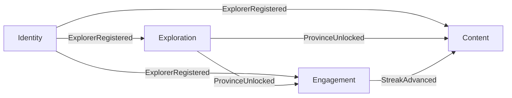

# DDD & Domain Model

VieGo is modelled with Domain-Driven Design. Each **bounded context** becomes one
[Spring Modulith module](backend-modular-monolith.md).

## Ubiquitous language (glossary)

The shared vocabulary used identically in specs, UI, and code. **Never introduce a synonym.**

| Term | Definition | Context |
|------|-----------|---------|
| **Explorer** | A user of VieGo; a cultural explorer/traveler | Identity |
| **Province** | A provincial region on the map; primary unit of exploration | Exploration |
| **Ward** | A sub-division of a Province with its own metadata | Exploration |
| **Unlock** | Gaining access to a Province's heritage | Exploration |
| **Unlocked status** | Whether a Province has been unlocked by the Explorer | Exploration |
| **Collection** | The set of Provinces an Explorer has unlocked | Exploration |
| **Streak** | Count of consecutive days completing a Discovery Ritual | Engagement |
| **Discovery Ritual** | The recurring daily activity that advances a Streak | Engagement |
| **Cultural Beat** | A unit of audio-visual heritage content | Content |
| **Regional Heritage** | The cultural content belonging to a Province | Content |
| **Trivia** | A quiz/knowledge item about a region | Content |
| **Auth Provider** | External identity source: Email, Google, Facebook, Zalo | Identity |
| **Preferences** | An Explorer's language and theme settings | Identity |

## Context map

Each context is one Modulith module under `com.viego.<module>`.

| Context | Module | Responsibility |
|---------|--------|----------------|
| **Exploration** | `exploration` | Interactive map, provinces/wards, unlocking, collection |
| **Engagement** | `engagement` | Streaks, discovery rituals, rewards |
| **Content** | `content` | Cultural Beats, regional heritage, trivia, media |
| **Identity** | `identity` | Explorer accounts, auth, language/theme preferences |
| _(shared kernel)_ | `shared` | Cross-cutting value objects only (ids, `LocalizedText`) |

Modules integrate through **published domain events**, not by calling internals. The full event
catalog is the [AsyncAPI spec](../../../01-core-specifications/api-system-specifications/domain-events.asyncapi.yaml).

## Domain model by context

### Exploration
- **Collection** _(aggregate root, per Explorer)_ — invariants: a Province appears at most once;
  added only via a valid Unlock.
- **Province** _(entity)_ — `id`, `name: LocalizedText`, `geometry`, `wards[]`, `unlocked`.
- **Ward** _(entity)_ — sub-division of a Province.
- Command `UnlockProvince` → event **`ProvinceUnlocked`**.
- Owns `exploration` schema. Subscribes to `ExplorerRegistered`.

### Engagement
- **Streak** _(aggregate root, per Explorer)_ — `current`, `longest`, `lastRitualDate`.
  Invariants: increments once per calendar day; a missed day resets `current` (emit
  `StreakBroken`); `longest` never decreases.
- **Discovery Ritual** — the qualifying daily activity (definition pending — see
  [feature](../../../01-core-specifications/executable-specifications/features/engagement/daily-streak.feature)).
- Events **`StreakAdvanced`**, **`StreakBroken`**. Owns `engagement` schema.
  Subscribes to `ProvinceUnlocked`, `ExplorerRegistered`.

### Content
- **Regional Heritage** _(aggregate root, per Province)_ — contains Cultural Beats & Trivia.
- **Cultural Beat** _(entity)_ — `id`, `title: LocalizedText`, `audioRef`.
- **Trivia** _(entity)_ — `question: LocalizedText`, `answers`.
- Access to a Province's heritage is granted when it is unlocked. Owns `content` schema.
  Subscribes to `ProvinceUnlocked`, `ExplorerRegistered`.

### Identity
- **Explorer** _(aggregate root)_ — `id`, `authProviders[]`, `profile`, `preferences`.
- **Preferences** _(value object)_ — `{ language, theme }`.
- **AuthProvider** _(value object)_ — `{ kind: email|google|facebook|zalo, ref }`.
- Events **`ExplorerRegistered`**, **`PreferencesUpdated`**. Owns `identity` schema. Upstream
  supplier to all other contexts.

## Shared value objects
- **LocalizedText** `{ vi, en, … }` — all user-facing text.
- **ExplorerId**, **ProvinceId** — typed ids used across boundaries (by value, never entities).
