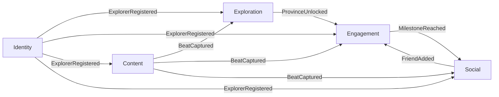

# DDD & Domain Model

VieGo is modelled with Domain-Driven Design. Each **bounded context** becomes one
[Spring Modulith module](backend-modular-monolith.md).

VieGo is a **social capture** app for exploring Vietnam: an Explorer opens the camera, snaps a
photo at a place, and that photo — a **Beat** — auto-tags its location, keeps their daily **Streak**
alive, **unlocks** the province it was taken in, and lands on their friends' maps and feeds. The
domain is organised around the life of a Beat, not around a catalogue of content.

## Ubiquitous language (glossary)

The shared vocabulary used identically in specs, UI, and code. **Never introduce a synonym.**

| Term | Definition | Context |
|------|-----------|---------|
| **Explorer** | A user of VieGo, identified by a unique **handle** (e.g. `@minh.dq`) | Identity |
| **Handle** | An Explorer's public `@username`, used in invite links and mentions | Identity |
| **Preferences** | An Explorer's language and theme settings | Identity |
| **Auth Provider** | External identity source: Email, Google, Facebook, Zalo | Identity |
| **Province** | A provincial region on the map; primary unit of exploration and unlocking | Exploration |
| **Ward** | A sub-division of a Province with its own metadata | Exploration |
| **Place** (POI) | A specific point of interest — café, heritage site, viewpoint — with local context | Exploration |
| **Unlock** | Adding a Province to the Collection by capturing your first Beat there | Exploration |
| **Collection** | The set of Provinces an Explorer has unlocked | Exploration |
| **Beat** | A **photo check-in**: a captured photo, auto-tagged with place + province, with an audience | Content |
| **Capture** | The act of taking a Beat with the in-app camera | Content |
| **Audience** | Who a Beat is sent to: **Friends** (a chosen list) or **Public** (the map/discover) | Content |
| **Review** | A traveller's short written note about a Place, verified by having been there | Content |
| **Memories** | An Explorer's personal, time-ordered history of their own Beats | Content |
| **Streak** | Count of consecutive days on which the Explorer captured at least one Beat | Engagement |
| **Milestone** | A streak achievement that unlocks a **Badge** (e.g. "Tuần Rực Lửa" — one full week) | Engagement |
| **Notification** | An event surfaced to the Explorer (streak reminder, like, friend's Beat, milestone) | Engagement |
| **Friendship** | A mutual connection between two Explorers | Social |
| **Invite Link** | A shareable link (`viego.app/add/@handle`) or QR that adds the sharer as a friend | Social |
| **Feed** | A stream of Beats — the **friend feed** (from your friends) or **Discover** (public) | Social |
| **Reaction** | A lightweight response to a Beat — a **like** (heart) or a **bolt** | Social |
| **LocalizedText** | User-facing text carried in every supported language (VI/EN priority) | shared |

## Context map

Each context is one Modulith module under `com.viego.<module>`.

| Context | Module | Responsibility |
|---------|--------|----------------|
| **Identity** | `identity` | Explorer accounts, handles, auth, language/theme preferences |
| **Exploration** | `exploration` | Interactive map, provinces/wards, places (POIs), unlocking, collection, search |
| **Content** | `content` | Beats (photo captures), reviews, memories, media delivery |
| **Engagement** | `engagement` | Streaks, milestones/badges, notifications |
| **Social** | `social` | Friendships, invite links, feeds (friend + discover), reactions |
| _(shared kernel)_ | `shared` | Cross-cutting value objects only (ids, `LocalizedText`) |

**`BeatCaptured` is the backbone event.** One capture fans out to three consumers at once —
Exploration unlocks the province, Engagement advances the streak, and Social pushes the Beat onto
friends' feeds. Modules integrate through **published domain events**, never by calling internals.
The full event catalog is the
[AsyncAPI spec](../../../01-core-specifications/api-system-specifications/domain-events.asyncapi.yaml).

## Domain model by context

### Identity
- **Explorer** _(aggregate root)_ — `id: ExplorerId`, `handle`, `authProviders[]`, `profile`,
  `preferences`.
  - *Invariants:* `handle` is unique; at least one `AuthProvider`; created **exactly once** per
    identity (repeat sign-ins authenticate, never re-register).
- **Preferences** _(value object)_ — `{ language: vi|en|…, theme: light|dark }`.
- **AuthProvider** _(value object)_ — `{ kind: email|google|facebook|zalo, ref }` (a provider
  subject id — never a password).
- Events **`ExplorerRegistered`**, **`PreferencesUpdated`**. Owns `identity` schema. Upstream
  supplier to every other context.

### Exploration
- **Collection** _(aggregate root, per Explorer)_ — the set of unlocked Provinces. *Invariants:* a
  Province appears at most once; added only via a valid **Unlock**.
- **Province** _(entity)_ — `id`, `name: LocalizedText`, `geometry`, `wards[]`, `unlocked`,
  `beatCount` (public check-ins, drives map heat).
- **Ward** _(entity)_ — sub-division of a Province.
- **Place** _(entity)_ — `id`, `name`, `category` (coffee/food/heritage/nature/nightlife/hidden),
  `provinceId`, `coordinates`, `hours`, `cost`, `localTip`, `description: LocalizedText`, `rating`.
- Consumes **`BeatCaptured`** → unlocks the Province of the Explorer's **first** Beat there;
  publishes **`ProvinceUnlocked`**. Subscribes to `ExplorerRegistered`. Owns `exploration` schema.

### Content
- **Beat** _(aggregate root, per capture)_ — `id`, `explorerId`, `photoRef`, `caption?`,
  `placeId?`, `provinceId`, `audience: Friends|Public`, `capturedAt`.
  - *Invariants:* immutable once captured; always carries a resolved `provinceId`; `Friends`
    audience carries a non-empty recipient list.
- **Review** _(entity)_ — `explorerId`, `placeId`, `note: text`, `rating`, `capturedAt`; only an
  Explorer who has a Beat at the Place may leave one ("verified by location").
- **Memories** — an Explorer's own Beats, time-ordered (a read model over their captures).
- Command `CaptureBeat` → event **`BeatCaptured`** (the backbone). Media lives in object storage;
  the DB holds `photoRef` + metadata. Owns `content` schema. Subscribes to `ExplorerRegistered`.

### Engagement
- **Streak** _(aggregate root, per Explorer)_ — `current`, `longest`, `lastCaptureDate`.
  *Invariants:* advances **at most once per calendar day**; a missed day resets `current` (emit
  `StreakBroken`); `longest` never decreases.
- **Milestone** _(entity)_ — a streak threshold (e.g. 7 days) that awards a **Badge**.
- **Notification** _(entity)_ — a surfaced event for the Explorer (streak reminder, like, friend
  Beat, milestone, new place nearby).
- **DayClock** _(port)_ — resolves "today" under the agreed timezone rule.
- Consumes **`BeatCaptured`** (advances the streak — capturing is the daily ritual),
  `ProvinceUnlocked`, `FriendAdded`, `ExplorerRegistered`. Publishes **`StreakAdvanced`**,
  **`StreakBroken`**, **`MilestoneReached`**. Owns `engagement` schema.

### Social
- **Friendship** _(aggregate root)_ — a mutual link between two Explorers. *Invariant:* symmetric;
  at most one Friendship per pair.
- **InviteLink** _(value object)_ — `viego.app/add/@handle`; resolving it and accepting creates a
  Friendship.
- **Feed** — read models projected from `BeatCaptured`: the **friend feed** (Beats whose audience
  includes me) and **Discover** (public Beats).
- **Reaction** _(entity)_ — a like or bolt on a Beat, by an Explorer.
- Consumes **`BeatCaptured`** (fan-out to feeds), `ExplorerRegistered`. Publishes **`FriendAdded`**,
  **`BeatReacted`**. Owns `social` schema.

## Shared value objects
- **LocalizedText** `{ vi, en, … }` — all user-facing text.
- **ExplorerId**, **ProvinceId**, **PlaceId**, **BeatId** — typed ids used across boundaries (by
  value, never entities).
