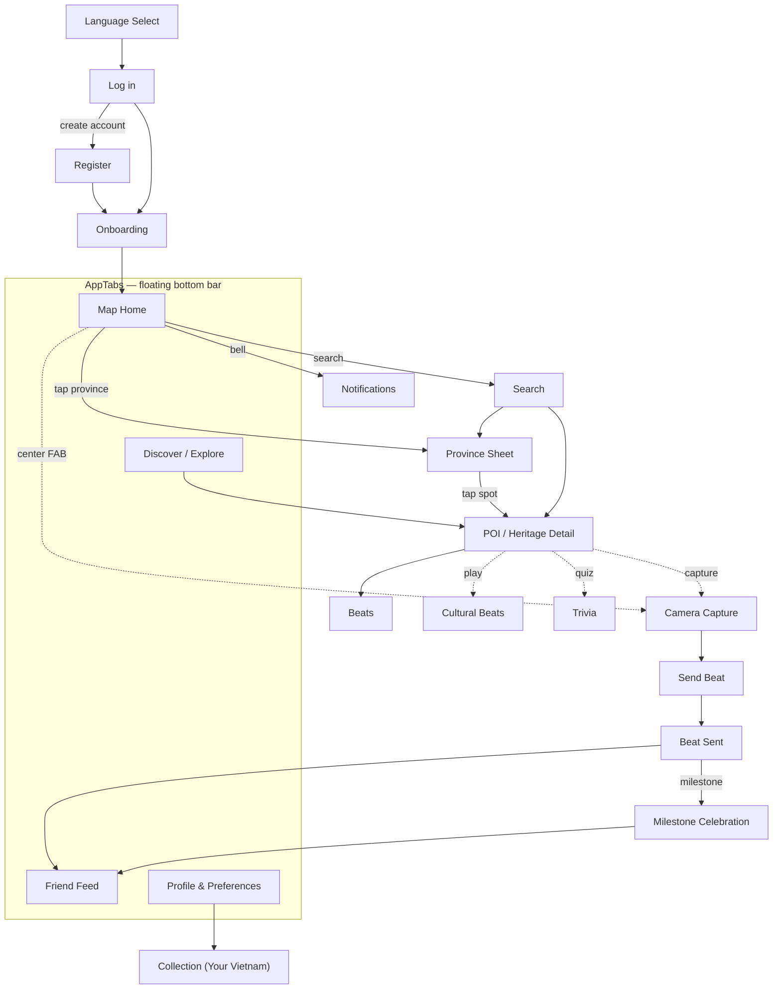

# Screens

Per-screen React Native design specs, grouped by [bounded context](../../software-architecture-document/ddd-and-domain-model.md).
Each screen maps to a `data-screen-label` in the [prototype](../../../../../prototype/index.html)
and to a route in the [navigation model](../README.md#navigation-model).

| # | Screen | Prototype label | Module | Spec |
|---|--------|-----------------|--------|------|
| 1 | Language Select | `Language` | Identity | [identity.md#language-select](identity.md#language-select) |
| 2 | Onboarding | `Onboarding` | Identity | [identity.md#onboarding](identity.md#onboarding) |
| 3 | Log in | `Log in` | Identity | [identity.md#log-in](identity.md#log-in) |
| 4 | Register | `Register` | Identity | [identity.md#register](identity.md#register) |
| 5 | Profile & Preferences | `Profile` | Identity | [identity.md#profile--preferences](identity.md#profile--preferences) |
| 6 | Notifications | `Notifications` | Identity | [identity.md#notifications](identity.md#notifications) |
| 7 | Map Home | `Map home` | Exploration | [exploration.md#map-home](exploration.md#map-home) |
| 8 | Province Sheet | (in `Map home`) | Exploration | [exploration.md#province-sheet](exploration.md#province-sheet) |
| 9 | Search | `Search` | Exploration | [exploration.md#search](exploration.md#search) |
| 10 | Discover / Explore | `Discovery` | Exploration | [exploration.md#discover--explore](exploration.md#discover--explore) |
| 11 | Collection ("Your Vietnam") | (in `Profile`) | Exploration | [exploration.md#collection-your-vietnam](exploration.md#collection-your-vietnam) |
| 12 | Camera Capture | `Camera` | Engagement | [engagement.md#camera-capture](engagement.md#camera-capture) |
| 13 | Send Beat | `Send beat` | Engagement | [engagement.md#send-beat](engagement.md#send-beat) |
| 14 | Beat Sent | `Beat sent` | Engagement | [engagement.md#beat-sent](engagement.md#beat-sent) |
| 15 | Milestone Celebration | `Milestone` | Engagement | [engagement.md#milestone-celebration](engagement.md#milestone-celebration) |
| 16 | Friend Feed | `Friend feed` | Engagement | [engagement.md#friend-feed](engagement.md#friend-feed) |
| 17 | POI / Heritage Detail | `POI detail` | Content | [content.md#poi--heritage-detail](content.md#poi--heritage-detail) |
| 18 | Cultural Beats | *(product; prototype-consistent)* | Content | [content.md#cultural-beats](content.md#cultural-beats) |
| 19 | Trivia | *(product; prototype-consistent)* | Content | [content.md#trivia](content.md#trivia) |

## Navigation graph

## Cross-cutting requirements (apply to every screen)

- **Themes** — render correct in light + dark ([tokens](../design-system.md#tokens)).
- **Locales** — no hard-coded strings; vi + en parity ([localization](../localization.md)).
- **Safe area** — respect notch/home-indicator via `useSafeAreaInsets()`.
- **Touch targets** — ≥ 44×44 px.
- **Motion** — gate animations on `useReducedMotion()`.
- **Loading/error** — server-backed screens define skeleton + Problem-Details error states.
