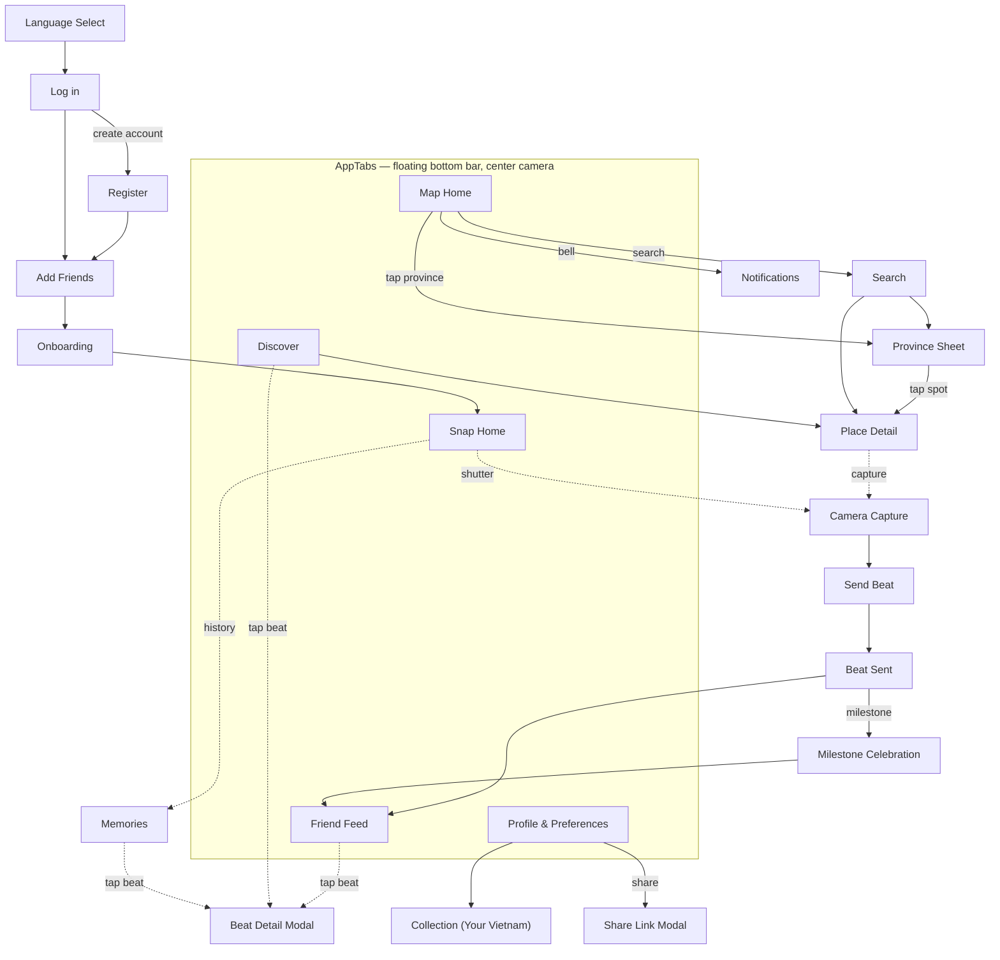

# Screens

Per-screen React Native design specs, grouped by [bounded context](../../software-architecture-document/ddd-and-domain-model.md).
Each screen maps to a `data-screen-label` in the [prototype](../../../../../prototype/VieGo.dc.html)
and to a route in the [navigation model](../README.md#navigation-model).

| # | Screen | Prototype label | Module | Spec |
|---|--------|-----------------|--------|------|
| 1 | Language Select | `Language` | Identity | [identity.md#language-select](identity.md#language-select) |
| 2 | Log in | `Log in` | Identity | [identity.md#log-in](identity.md#log-in) |
| 3 | Register | `Register` | Identity | [identity.md#register](identity.md#register) |
| 4 | Add Friends | `Add friends post signup` | Social | [social.md#add-friends](social.md#add-friends) |
| 5 | Onboarding | `Onboarding` | Identity | [identity.md#onboarding](identity.md#onboarding) |
| 6 | Profile & Preferences | `Profile` | Identity | [identity.md#profile--preferences](identity.md#profile--preferences) |
| 7 | Map Home | `Map home` | Exploration | [exploration.md#map-home](exploration.md#map-home) |
| 8 | Province Sheet | (in `Map home`) | Exploration | [exploration.md#province-sheet](exploration.md#province-sheet) |
| 9 | Search | `Search` | Exploration | [exploration.md#search](exploration.md#search) |
| 10 | Place Detail | `POI detail` | Exploration | [exploration.md#place-detail](exploration.md#place-detail) |
| 11 | Collection ("Your Vietnam") | (in `Profile`) | Exploration | [exploration.md#collection-your-vietnam](exploration.md#collection-your-vietnam) |
| 12 | Snap Home | `Snap home` | Content | [content.md#camera-capture](content.md#camera-capture) |
| 13 | Camera Capture | `Camera` | Content | [content.md#camera-capture](content.md#camera-capture) |
| 14 | Send Beat | `Send beat` | Content | [content.md#send-beat](content.md#send-beat) |
| 15 | Beat Sent | `Beat sent` | Content | [content.md#beat-sent](content.md#beat-sent) |
| 16 | Beat Detail Modal | `Beat detail modal` | Content | [content.md#beat-detail-modal](content.md#beat-detail-modal) |
| 17 | Memories | `Memories` | Content | [content.md#memories](content.md#memories) |
| 18 | Milestone Celebration | `Milestone` | Engagement | [engagement.md#milestone-celebration](engagement.md#milestone-celebration) |
| 19 | Notifications | `Notifications` | Engagement | [engagement.md#notifications](engagement.md#notifications) |
| 20 | Friend Feed | `Friend feed` | Social | [social.md#friend-feed](social.md#friend-feed) |
| 21 | Discover | `Discovery` | Social | [social.md#discover](social.md#discover) |
| 22 | Share Link Modal | `Share link modal` | Social | [social.md#share-link-modal](social.md#share-link-modal) |

## Navigation graph

## Cross-cutting requirements (apply to every screen)

- **Themes** — render correct in light + dark ([tokens](../design-system.md#tokens)).
- **Locales** — no hard-coded strings; vi + en parity ([localization](../localization.md)).
- **Safe area** — respect notch/home-indicator via `useSafeAreaInsets()`.
- **Touch targets** — ≥ 44×44 px.
- **Motion** — gate animations on `useReducedMotion()`.
- **Loading/error** — server-backed screens define skeleton + Problem-Details error states.
