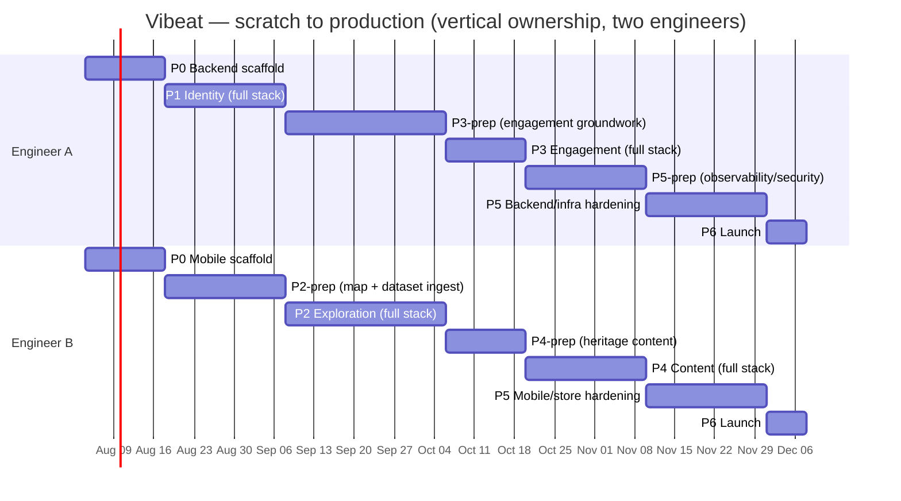

# Plans, Estimates, Schedules

The delivery plan that turns the [roadmap & backlog](roadmaps-and-backlogs.md) into a sequenced,
estimated schedule. This page holds the **two-engineer, scratch-to-production roadmap**. Each
product phase (P1–P4) builds one module whose low-level design is in the
[Detailed Design](../01-product-documentation/02-authored-system-documentation/software-architecture-document/design/)
section — the phase and its design doc are cross-linked.

## Team model

Two **full-stack** engineers, working **contract-first** and **trunk-based**, with **vertical
ownership**: each phase's feature is owned **end-to-end (backend → API → mobile UI)** by one
engineer, while the other pipelines the *next* phase's independent groundwork (~half a phase
ahead) against the agreed contracts. Ownership swaps every phase.

| Engineer | Full-stack ownership across phases |
|----------|-------------------------------------|
| **Engineer A** | P0 backend scaffold · **P1 Identity** (full stack) · **P3 Engagement** (full stack) · P5 backend/infra hardening · P6 Launch |
| **Engineer B** | P0 mobile scaffold · **P2 Exploration** (full stack) · **P4 Content** (full stack) · P5 mobile/store hardening · P6 Launch |

**Ways of working**
- The [OpenAPI](../01-product-documentation/01-core-specifications/api-system-specifications/rest-api.openapi.yaml)
  and [AsyncAPI](../01-product-documentation/01-core-specifications/api-system-specifications/domain-events.asyncapi.yaml)
  contracts are agreed **before** each feature — this is what lets the non-owning engineer
  pipeline the next phase's groundwork (data ingestion, UI component ports, aggregate skeletons)
  without waiting on the current phase to land.
- Every phase's "done" is defined by the matching
  [executable spec](../01-product-documentation/01-core-specifications/executable-specifications/)
  passing in CI, plus `ApplicationModules.verify()` staying green.
- Because ownership rotates full-stack every phase, both engineers cross-train on the whole
  system as a side effect of the schedule — not as a separate initiative.
- Weekly sync to clear the **open product decisions** (below) before they block a phase.

## Estimate & assumptions

- **~18 weeks (~4.5 months)** from an empty [monorepo](../01-product-documentation/02-authored-system-documentation/software-architecture-document/decisions/0006-monorepo-source-control.md)
  to production, for two engineers full-time.
  Vertical ownership doesn't change this total: the non-owning engineer uses the same calendar
  time productively on next-phase prep, then the two swap.
- Assumes datasets exist (they do — the prototype's province data), design system exists
  (`DESIGN.md`), and infra is a managed container platform + managed Postgres.
- Timeline is **relative** (Week 1…18); the example calendar starts **2026-08-04** and can shift.

## Roadmap at a glance



## Phase 0 — Walking skeleton (Weeks 1–2)
**Goal:** the monorepo builds (`backend/` + `mobile/`), a trivial vertical slice runs in the
**dev** environment, path-scoped CI is green, and module-boundary verification is wired from day
one. (No feature vertical exists yet, so this phase is still split by app.)

| Engineer A (backend scaffold) | Engineer B (mobile scaffold) |
|--------------------------------|-------------------------------|
| Maven + Spring Boot (Java 25) project | React Native + TypeScript app scaffold |
| Spring Modulith with empty modules (`identity/exploration/engagement/content/shared`) + `ApplicationModules.verify()` test | Navigation shell (Auth stack + tab placeholders) |
| Postgres via Docker Compose + Flyway wiring; Actuator health | Design tokens from `DESIGN.md`; UI primitives (Button/Card/Input) |
| One trivial endpoint + springdoc OpenAPI; Dockerize | i18n scaffold (vi/en); theme switch; API client skeleton |
| CI: build → test → scan → image → deploy to dev | CI: typecheck → lint → test → build |

**Shared decisions:** Expo vs. bare RN (finish [ADR-0003](../01-product-documentation/02-authored-system-documentation/software-architecture-document/decisions/0003-react-native-for-mobile.md));
branch strategy; dev environment.
**Exit:** app calls the dev backend's health/ping; CI green both sides; `verify()` green; deployed to dev.

## Phase 1 — Identity & foundations (Weeks 3–5)
**Goal:** authentication end-to-end; Explorer + preferences; the event log proven; contract-first
flow validated on a real feature.
Spec: [`authentication.feature`](../01-product-documentation/01-core-specifications/executable-specifications/features/identity/authentication.feature).
Design: [Identity module design](../01-product-documentation/02-authored-system-documentation/software-architecture-document/design/identity.md).

**Owner — Engineer A (full stack, backend → mobile):**
- `identity` module: Explorer aggregate, preferences
- OIDC auth: **Email + Google** first; JWT issue/refresh; Spring Security
- `ExplorerRegistered` / `PreferencesUpdated` events + Modulith JPA outbox
- Preferences endpoints; contract + module tests
- Auth screens (welcome / sign-in / register); OAuth flows (Email + Google); secure token storage
- Profile & preferences screen; wire language/theme to preferences
- React Query + Problem-Details error handling

**Meanwhile — Engineer B (P2 groundwork, no identity dependency yet):**
- Ingest canonical datasets into the `exploration` schema
- Port `<vn-map>` to an RN SVG map component

**Fast-follow:** Facebook + Zalo providers (can slip to P5).
**Exit:** sign in (Email+Google), set language/theme, persists across sessions; `@ready` auth
scenarios pass; first real contract + BDD tests in CI.

## Phase 2 — Core loop: Exploration (Weeks 6–9)
**Goal:** the heart of the product — map, province **unlocking**, collection.
Spec: [`province-unlocking.feature`](../01-product-documentation/01-core-specifications/executable-specifications/features/exploration/province-unlocking.feature).
Design: [Exploration module design](../01-product-documentation/02-authored-system-documentation/software-architecture-document/design/exploration.md).
**Prereq:** the **unlock condition** decision (see open decisions).

**Owner — Engineer B (full stack, building on P1's groundwork):**
- `Collection` aggregate + invariants; `UnlockProvince`
- `ProvinceUnlocked` event; `ExplorerRegistered` listener (wires up to P1's identity events)
- Endpoints: `/provinces`, `/provinces/{id}/unlock`, `/collection/me`
- MapTab with provinces + unlocked (gold) fill (on top of the map component ported in P1)
- Province detail + unlock flow + celebratory animation (reduced-motion aware)
- CollectionTab; offline cache basics

**Meanwhile — Engineer A (P3 groundwork, design-only until `ProvinceUnlocked` exists):**
- `engagement` module skeleton: `Streak` aggregate + invariants (once/day, reset, longest)
- StreakTab UI scaffolding + counter animation component

**Exit:** unlock a province → gold fill + collection update, end-to-end green; `@ready` unlock
scenarios pass; map rendering performance acceptable.

## Phase 3 — Engagement: Streaks (Weeks 10–11)
**Goal:** daily **streak** & discovery ritual.
Spec: [`daily-streak.feature`](../01-product-documentation/01-core-specifications/executable-specifications/features/engagement/daily-streak.feature).
Design: [Engagement module design](../01-product-documentation/02-authored-system-documentation/software-architecture-document/design/engagement.md).
**Prereq:** **discovery ritual** definition + day/timezone rule.

**Owner — Engineer A (full stack, integrating P2's groundwork):**
- Wire the `ProvinceUnlocked` listener into the `engagement` module; ritual-completion use case
- `StreakAdvanced` / `StreakBroken`; `/streaks/me`; break evaluation + timezone
- Integrate StreakTab (built in P2) with live data; daily ritual prompt
- Basic milestone/reward surfaces

**Meanwhile — Engineer B (P4 groundwork):**
- Source heritage content for launch provinces; object storage/CDN pipeline groundwork
- Audio beat player component; trivia UI scaffolding

**Exit:** streak advances once/day and breaks correctly (tested with clock control); `@ready`
streak scenarios pass.

## Phase 4 — Content: Heritage & Beats (Weeks 12–14)
**Goal:** the cultural payoff — heritage access, **Cultural Beats**, trivia.
Spec: [`heritage-access.feature`](../01-product-documentation/01-core-specifications/executable-specifications/features/content/heritage-access.feature).
Design: [Content module design](../01-product-documentation/02-authored-system-documentation/software-architecture-document/design/content.md).

**Owner — Engineer B (full stack, building on P3's groundwork):**
- `content` module: RegionalHeritage / CulturalBeat / Trivia
- Access grant via `ProvinceUnlocked` listener; gating (403 when locked)
- Media: object storage + signed/CDN URLs; endpoints
- Heritage screen integration; audio beat player wired to real content; trivia UI + gating UX
- Localized content rendering (VI/EN)

**Meanwhile — Engineer A (P5 groundwork):**
- Observability/security tooling groundwork: dashboards scaffolding, dependency & container scan config

**Shared:** seed real heritage content for a handful of launch provinces.
**Exit:** unlocked province shows playable beats + trivia in VI/EN; `@ready` content scenarios pass.

## Phase 5 — Hardening & production readiness (Weeks 15–17)
**Goal:** make it launch-grade. Driven by the [Release Checklist](release-checklist.md). Not a
single vertical feature, so this phase is **joint**, split by concern rather than by owner-per-phase.

| Engineer A — backend/infra | Engineer B — mobile/store |
|------------------------------|------------------------------|
| Observability: logs/metrics/traces, dashboards, alerts (incl. event-log backlog) | Sentry on mobile; crash-free rate monitoring |
| Security review: auth/secrets/rate-limiting; dependency + container scans clean | Accessibility + VI/EN parity audit across all screens, both themes |
| Performance: API + map-backend load testing; DB indexing; caching | Performance: map render + list scroll profiling on low-end devices |
| Ops: staging cutover; blue/green deploy + **rollback rehearsal**; migration safety (expand/contract) | Store prep: metadata, screenshots, privacy disclosures; TestFlight / Play **beta** + feedback loop |
| Runbooks: complete them; run an incident-response drill | Auth completeness: add Facebook + Zalo if deferred (mobile side) |

**Exit:** Release Checklist fully green; beta feedback addressed.

## Phase 6 — Launch (Week 18)
- Deploy backend to **production**; submit app to **App Store + Google Play** production.
- Hypercare: monitor dashboards, keep rollback ready.

**Exit:** live in production, healthy dashboards, rollback path verified.

## Critical path & dependencies
```
P0 skeleton → P1 identity (auth + events) → P2 exploration (unlock + ProvinceUnlocked)
   → P3 engagement (listens to ProvinceUnlocked) → P4 content (listens to ProvinceUnlocked) → P5 → P6
```
- **Identity is the gate** — everything needs an authenticated Explorer.
- **`ProvinceUnlocked`** is the backbone event; Engagement and Content both hang off it, so P2's
  event contract must be right before P3/P4.
- Whichever engineer isn't the current phase's full-stack owner stays **~½ phase ahead** by
  pipelining the next phase's independent groundwork (data/content prep, UI component ports,
  aggregate skeletons) against the agreed OpenAPI/AsyncAPI contracts, then takes over as owner
  once the gating event lands.

## Open product decisions (resolve before the phase that needs them)
| Decision | Needed by | Owner |
|----------|-----------|-------|
| **Unlock condition** (proximity / trivia / tap / purchase) | Phase 2 | Product |
| **Discovery ritual** definition + day/timezone rule | Phase 3 | Product |
| **Account linking** across providers | Phase 5 (can defer) | Product |
| Expo vs. bare React Native | Phase 0 | Eng |
| Hosting platform + observability stack | Phase 5 | Eng |

## Risks & mitigations
| Risk | Impact | Mitigation |
|------|--------|-----------|
| Product decisions slip | Blocks P2/P3 | Decide in Week-by-week sync; keep `@draft` scenarios explicit |
| Map performance on low-end devices | UX | Prototype early in P2; profile; virtualize/simplify SVG |
| OAuth provider integration (esp. Zalo) friction | Auth delay | Start with Email+Google in P1; treat Facebook/Zalo as fast-follow |
| App-store review delays | Launch date | Enter TestFlight/Play beta in P5, not P6; keep API `/v1` backward-compatible |
| Two-person bus factor | Continuity | Contract-first + docs-as-source-of-truth; rotating full-stack ownership already cross-trains both engineers on the whole system |
| Vertical ownership stalls if the gating event slips | Delays the next owner's start, not just the current phase | The non-owning engineer's prep work is scoped to be independent of the gate, so it never blocks; only the *integration* step waits |

## Milestone summary
| Milestone | Phase | Exit criteria |
|-----------|-------|---------------|
| **M0 Foundations** | P0 | Skeleton runs in dev; CI green; `verify()` green |
| **M1 Core loop** | P1–P2 | Auth + unlocking + collection specs pass |
| **M2 Engagement** | P3 | Streak specs pass |
| **M3 Content** | P4 | Heritage/beats/trivia specs pass |
| **M4 Launch-ready** | P5 | Release Checklist green; beta validated |
| **Production** | P6 | Live on App Store + Play; healthy |
