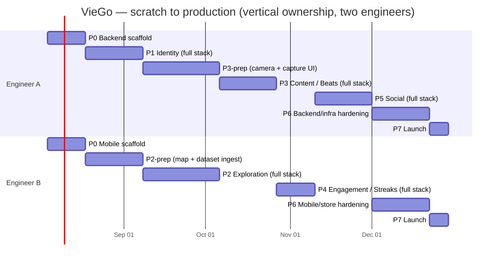

# Plans, Estimates, Schedules

The **detailed view** of the [Product Roadmap](roadmaps-and-backlogs.md). The roadmap says *which
version ships when*; this page says *how each one gets built* — by whom, in what order, and against
which specs.

## How to read this page

- A **phase (P0–P7) is one product feature, planned like a sprint**: a single goal, a named
  full-stack owner, an estimate in weeks, and explicit exit criteria.
- Each phase delivers exactly one **release** on the roadmap's
  [release train](roadmaps-and-backlogs.md#release-train) (P0 → v0.1, P1 → v0.2, … P7 → v1.0).
- A phase decomposes into **one or more smaller specs** — each a
  [Spec Kit](sdd-standards/) feature folder under [`specs/`](../../specs/) with its own
  `spec.md` → `plan.md` → `tasks.md`. A spec is the unit an engineer actually picks up; a phase is
  the unit the roadmap tracks. Every phase below lists its specs.
- Each product phase (P1–P5) builds one module whose low-level design is in the
  [Detailed Design](../01-product-documentation/02-authored-system-documentation/software-architecture-document/design/)
  section — the phase and its design doc are cross-linked.

| Level | Artifact | Owner | Tracked in |
|-------|----------|-------|-----------|
| Product | Version (v0.1 … v1.0) | Product | [Product Roadmap](roadmaps-and-backlogs.md) |
| Phase / sprint | Phase P0–P7 | One full-stack engineer | This page |
| Spec | `specs/NNN-slug/` | One engineer | `spec.md` · `plan.md` · `tasks.md` |
| Task | `tasks.md` checkbox | — | The spec's `tasks.md` |

## Team model

Two **full-stack** engineers, working **contract-first** and **trunk-based**, with **vertical
ownership**: each phase's feature is owned **end-to-end (backend → API → mobile UI)** by one
engineer, while the other pipelines the *next* phase's independent groundwork (~half a phase
ahead) against the agreed contracts. Ownership swaps every phase.

| Engineer | Full-stack ownership across phases |
|----------|-------------------------------------|
| **Engineer A** | P0 backend scaffold · **P1 Identity** · **P3 Content (Beats)** · **P5 Social** · P6 backend/infra hardening · P7 Launch |
| **Engineer B** | P0 mobile scaffold · **P2 Exploration** · **P4 Engagement** · P6 mobile/store hardening · P7 Launch |

**Ways of working**
- The [OpenAPI](../01-product-documentation/01-core-specifications/api-system-specifications/rest-api.openapi.yaml)
  and [AsyncAPI](../01-product-documentation/01-core-specifications/api-system-specifications/domain-events.asyncapi.yaml)
  contracts are agreed **before** each feature — this is what lets the non-owning engineer
  pipeline the next phase's groundwork (data ingestion, UI component ports, aggregate skeletons)
  without waiting on the current phase to land.
- Every phase's "done" is defined by the matching
  [executable spec](../01-product-documentation/01-core-specifications/executable-specifications/)
  passing in CI, plus `ApplicationModules.verify()` staying green.
- A phase is **cut into its specs at the start of the phase**, not months ahead: the owner takes
  each spec through `spec.md` → `plan.md` → `tasks.md` before building it. The "planned" spec rows
  below are therefore *intent* — slugs and numbers are fixed only when the folder is created.
- Because ownership rotates full-stack every phase, both engineers cross-train on the whole
  system as a side effect of the schedule — not as a separate initiative.
- Weekly sync to clear the **open product decisions** (below) before they block a phase.

## Estimate & assumptions

- **~21 weeks (~5 months)** from an empty [monorepo](../01-product-documentation/02-authored-system-documentation/software-architecture-document/decisions/0006-monorepo-source-control.md)
  to production, for two engineers full-time.
- Assumes datasets exist (the prototype's province/place data), the design system and
  screen/component specs exist (`DESIGN.md` +
  [UI/UX Design Document](../01-product-documentation/02-authored-system-documentation/ui-ux-design-document/)),
  and infra is a managed container platform + managed Postgres.
- Timeline is **relative** (Week 1…21); the example calendar starts **2026-08-04** and can shift.

## Phase index

| Phase | Feature (sprint goal) | Weeks | Ships | Owner | Specs |
|-------|----------------------|-------|-------|-------|-------|
| **P0** | Walking skeleton | 1–2 | **v0.1** | A + B (split by app) | 1 |
| **P1** | Identity & foundations | 3–5 | **v0.2** | Engineer A | 3 |
| **P2** | Exploration: map, places & unlocking | 6–9 | **v0.3** | Engineer B | 3 |
| **P3** | Content: Beats (the core loop) | 10–12 | **v0.4** | Engineer A | 3 |
| **P4** | Engagement: streaks & milestones + notification sink | 13–14 | **v0.5** | Engineer B | 3 |
| **P5** | Social: friends & feeds | 15–17 | **v0.6** | Engineer A | 3 |
| **P6** | Hardening & production readiness | 18–20 | **v0.9** | A + B (split by concern) | 2 |
| **P7** | Launch | 21 | **v1.0** | A + B | — |

Spec status legend used below: **done** (tasks complete, merged) · **in progress** ·
**drafted** (spec folder exists, not started) · **planned** (not yet created — slug is indicative).

## Roadmap at a glance



## Phase 0 — Walking skeleton (Weeks 1–2) · ships **v0.1**
**Goal:** the monorepo builds (`backend/` + `mobile/`), a trivial vertical slice runs in the
**dev** environment, path-scoped CI is green, and module-boundary verification is wired from day
one. (No feature vertical exists yet, so this phase is still split by app.)
UI/UX: [Design System + RN translation layer](../01-product-documentation/02-authored-system-documentation/ui-ux-design-document/design-system.md) ·
[Core UI components](../01-product-documentation/02-authored-system-documentation/ui-ux-design-document/components/core.md) ·
[Navigation & tab bar](../01-product-documentation/02-authored-system-documentation/ui-ux-design-document/components/navigation.md).

| Engineer A (backend scaffold) | Engineer B (mobile scaffold) |
|--------------------------------|-------------------------------|
| Spring Boot 4 (Java 25) project scaffolded via **Spring CLI** ([ADR-0009](../01-product-documentation/02-authored-system-documentation/software-architecture-document/decisions/0009-spring-boot-4-and-spring-cli-scaffolding.md)) | React Native + TypeScript app scaffold |
| Spring Modulith with empty modules (`identity/exploration/content/engagement/social/shared`) + `ApplicationModules.verify()` test | [Navigation shell](../01-product-documentation/02-authored-system-documentation/ui-ux-design-document/README.md#navigation-model) (Auth stack + [floating tab bar](../01-product-documentation/02-authored-system-documentation/ui-ux-design-document/components/navigation.md#bottomtabbar) placeholders) |
| Postgres via Docker Compose + Flyway wiring; Actuator health | [Design tokens](../01-product-documentation/02-authored-system-documentation/ui-ux-design-document/design-system.md#tokens) from `DESIGN.md`; [UI primitives](../01-product-documentation/02-authored-system-documentation/ui-ux-design-document/components/core.md) (Button/Card/Input) |
| One trivial endpoint + springdoc OpenAPI; Dockerize | i18n scaffold (vi/en); theme switch; API client skeleton |
| CI: build → test → scan → image → deploy to dev | CI: typecheck → lint → test → build |

**Specs in this phase**

| Spec | Scope | Owner | Status |
|------|-------|-------|--------|
| [`001-phase-0-walking-skeleton`](../../specs/001-phase-0-walking-skeleton/spec.md) | The whole phase as one spec: backend + mobile scaffolds, dev deploy, CI, `verify()` | A + B | done |

**Shared decisions:** Expo vs. bare RN (finish [ADR-0003](../01-product-documentation/02-authored-system-documentation/software-architecture-document/decisions/0003-react-native-for-mobile.md));
branch strategy; dev environment.
**Exit:** app calls the dev backend's health/ping; CI green both sides; `verify()` green; deployed to dev.

## Phase 1 — Identity & foundations (Weeks 3–5) · ships **v0.2**
**Goal:** authentication end-to-end; Explorer + handle + preferences; the event log proven;
contract-first flow validated on a real feature.
Spec: [`authentication.feature`](../01-product-documentation/01-core-specifications/executable-specifications/features/identity/authentication.feature).
Design: [Identity module design](../01-product-documentation/02-authored-system-documentation/software-architecture-document/design/identity.md).
UI/UX: [Identity screens](../01-product-documentation/02-authored-system-documentation/ui-ux-design-document/screens/identity.md) —
[Language](../01-product-documentation/02-authored-system-documentation/ui-ux-design-document/screens/identity.md#language-select) ·
[Log in](../01-product-documentation/02-authored-system-documentation/ui-ux-design-document/screens/identity.md#log-in) ·
[Register](../01-product-documentation/02-authored-system-documentation/ui-ux-design-document/screens/identity.md#register) ·
[Onboarding](../01-product-documentation/02-authored-system-documentation/ui-ux-design-document/screens/identity.md#onboarding) ·
[Profile & Preferences](../01-product-documentation/02-authored-system-documentation/ui-ux-design-document/screens/identity.md#profile--preferences).

**Owner — Engineer A (full stack, backend → mobile):**
- `identity` module: Explorer aggregate, unique **handle**, preferences
- OIDC auth: **Email + Google** first; JWT issue/refresh; Spring Security
- `ExplorerRegistered` / `PreferencesUpdated` events + Modulith JPA outbox
- Preferences endpoints; contract + module tests
- Auth screens (language / sign-in / register); OAuth flows (Email + Google); secure token storage
- Profile & preferences screen; wire language/theme to preferences
- React Query + Problem-Details error handling

**Meanwhile — Engineer B (P2 groundwork, no identity dependency yet):**
- Ingest canonical province/place datasets into the `exploration` schema
- Port `<vn-map>` to an RN SVG map component

**Specs in this phase**

| Spec | Scope | Owner | Status |
|------|-------|-------|--------|
| [`003-modular-database-schemas`](../../specs/003-modular-database-schemas/spec.md) | Backend data foundation: per-module schemas, 5 Flyway beans, TSID/UUID key strategy — unblocks every later module | A | done |
| [`002-theme-components-identity`](../../specs/002-theme-components-identity/spec.md) | Mobile foundation: theme, component base, tooling, and the first-launch identity screens on **mock data** | B → A | done |
| `identity-auth-backend` *(planned)* | Live auth: Explorer aggregate + handle, OIDC (Email + Google), JWT, preferences endpoints, `ExplorerRegistered`/`PreferencesUpdated` + outbox; mobile swapped off mock data onto the real API | A | planned |

**Fast-follow:** Facebook + Zalo providers (can slip to P5).
**Exit:** sign in (Email+Google), get a handle, set language/theme, persists across sessions;
`@ready` auth scenarios pass; first real contract + BDD tests in CI.

## Phase 2 — Exploration: map, places & unlocking (Weeks 6–9) · ships **v0.3**
**Goal:** the map surface — provinces with heat, **places (POIs)**, search, collection, and the
capture-driven **unlock** listener (ready for P3's `BeatCaptured`).
Spec: [`province-unlocking.feature`](../01-product-documentation/01-core-specifications/executable-specifications/features/exploration/province-unlocking.feature).
Design: [Exploration module design](../01-product-documentation/02-authored-system-documentation/software-architecture-document/design/exploration.md).
UI/UX: [Exploration screens](../01-product-documentation/02-authored-system-documentation/ui-ux-design-document/screens/exploration.md) —
[Map Home](../01-product-documentation/02-authored-system-documentation/ui-ux-design-document/screens/exploration.md#map-home) ·
[Province Sheet](../01-product-documentation/02-authored-system-documentation/ui-ux-design-document/screens/exploration.md#province-sheet) ·
[Place Detail](../01-product-documentation/02-authored-system-documentation/ui-ux-design-document/screens/exploration.md#place-detail) ·
[Collection](../01-product-documentation/02-authored-system-documentation/ui-ux-design-document/screens/exploration.md#collection-your-vietnam) ·
[Search](../01-product-documentation/02-authored-system-documentation/ui-ux-design-document/screens/exploration.md#search);
[Map components (`<VnMap>`)](../01-product-documentation/02-authored-system-documentation/ui-ux-design-document/components/map.md).

**Owner — Engineer B (full stack, building on P1's groundwork):**
- `Collection` aggregate + invariants; province/ward/place ingestion
- `BeatCaptured` listener (first capture → unlock) + `ProvinceUnlocked` event *(wired to real captures in P3)*
- Endpoints: `/provinces`, `/provinces/{id}`, `/places/{id}`, `/collection/me`, `/search`
- MapTab with provinces + unlocked (gold) fill + heat; province sheet; place detail; search
- CollectionTab; offline cache basics

**Meanwhile — Engineer A (P3 groundwork, camera-side):**
- `content` module skeleton: `Beat` aggregate + invariants; camera + capture UI scaffolding

**Specs in this phase**

| Spec | Scope | Owner | Status |
|------|-------|-------|--------|
| `exploration-place-dataset` *(planned)* | Canonical province/ward/place ingestion into the `exploration` schema + `/provinces`, `/places/{id}`, `/search` endpoints | B | planned |
| `exploration-map-collection` *(planned)* | `<VnMap>` RN component, Map Home, province sheet, place detail, Collection tab, offline cache basics | B | planned |
| `exploration-province-unlocking` *(planned)* | `Collection` aggregate + invariants, `BeatCaptured` listener → `ProvinceUnlocked` (against the stub contract until P3) | B | planned |

**Exit:** map, places, search, and collection render end-to-end; the unlock listener is in place;
`@ready` unlock scenarios pass against a stub `BeatCaptured`; map rendering performance acceptable.

## Phase 3 — Content: Beats (the core loop) (Weeks 10–12) · ships **v0.4**
**Goal:** the heart of the product — capture a **Beat**, publish **`BeatCaptured`**, and see it
unlock the province and populate memories. This closes the core loop.
Spec: [`beat-capture.feature`](../01-product-documentation/01-core-specifications/executable-specifications/features/content/beat-capture.feature).
Design: [Content module design](../01-product-documentation/02-authored-system-documentation/software-architecture-document/design/content.md).
UI/UX: [Content screens](../01-product-documentation/02-authored-system-documentation/ui-ux-design-document/screens/content.md) —
the capture flow [Camera](../01-product-documentation/02-authored-system-documentation/ui-ux-design-document/screens/content.md#camera-capture) →
[Send](../01-product-documentation/02-authored-system-documentation/ui-ux-design-document/screens/content.md#send-beat) →
[Sent](../01-product-documentation/02-authored-system-documentation/ui-ux-design-document/screens/content.md#beat-sent) ·
[Beat Detail Modal](../01-product-documentation/02-authored-system-documentation/ui-ux-design-document/screens/content.md#beat-detail-modal) ·
[Memories](../01-product-documentation/02-authored-system-documentation/ui-ux-design-document/screens/content.md#memories).

**Owner — Engineer A (full stack, closing the loop with P2):**
- `content` module: `Beat` aggregate, `CaptureBeat`, audience (Friends/Public), reviews
- **`BeatCaptured`** event → wires into P2's unlock listener
- Media: object storage + signed/CDN URLs; endpoints `/beats`, `/beats/{id}`, `/memories/me`
- Camera + Send + Beat Sent flow; Beat detail modal; Memories screen
- Location resolution (province tag; suppressed outside Vietnam)

**Meanwhile — Engineer B (P4 groundwork):**
- `engagement` module skeleton: `Streak` aggregate + invariants (once/day, reset, longest)
- Streak surfaces + counter/celebration animation components

**Specs in this phase**

| Spec | Scope | Owner | Status |
|------|-------|-------|--------|
| `content-beat-capture` *(planned)* | `Beat` aggregate, `CaptureBeat`, audience, location resolution, **`BeatCaptured`** event contract; `/beats` endpoints | A | planned |
| `content-media-pipeline` *(planned)* | Object storage upload, signed/CDN URLs, image processing per [ADR-0013](../01-product-documentation/02-authored-system-documentation/software-architecture-document/decisions/0013-object-storage-for-beat-media.md) | A | planned |
| `content-capture-ui-memories` *(planned)* | Camera → Send → Beat Sent flow, Beat detail modal, Memories screen, optimistic upload UX | A | planned |

**Exit:** capture a Beat → it unlocks the province (gold fill), appears in Memories, and emits
`BeatCaptured`; `@ready` beat-capture + unlock scenarios pass end-to-end.

## Phase 4 — Engagement: Streaks & milestones (Weeks 13–14) · ships **v0.5**
**Goal:** daily **streak** driven by capture, plus milestones/badges, and the **notification**
delivery sink (first publisher: `MilestoneReached`).
Spec: [`daily-streak.feature`](../01-product-documentation/01-core-specifications/executable-specifications/features/engagement/daily-streak.feature).
Design: [Engagement module design](../01-product-documentation/02-authored-system-documentation/software-architecture-document/design/engagement.md).
UI/UX: [Engagement screens](../01-product-documentation/02-authored-system-documentation/ui-ux-design-document/screens/engagement.md) —
[Milestone](../01-product-documentation/02-authored-system-documentation/ui-ux-design-document/screens/engagement.md#milestone-celebration) ·
[Notifications](../01-product-documentation/02-authored-system-documentation/ui-ux-design-document/screens/engagement.md#notifications) ·
[Streak surfaces](../01-product-documentation/02-authored-system-documentation/ui-ux-design-document/screens/engagement.md#streak-surfaces-shared).
**Prereq:** the **day/timezone rule** (see open decisions).

**Owner — Engineer B (full stack, integrating P3's `BeatCaptured`):**
- Wire the `BeatCaptured` listener into `engagement`; advance-streak use case
- `StreakAdvanced` / `StreakBroken` / `MilestoneReached`; `/streaks/me`; break evaluation + timezone
- Milestone/badge + celebration
- `notification` module: fan-in listener for `MilestoneReached`, `/notifications/me` feed + unread count
- Integrate streak surfaces (built in P3 prep) with live data

**Meanwhile — Engineer A (P5 groundwork):**
- `social` module skeleton: friendship + feed projection design; invite-link handling

**Specs in this phase**

| Spec | Scope | Owner | Status |
|------|-------|-------|--------|
| `engagement-daily-streak` *(planned)* | `Streak` aggregate, `BeatCaptured` listener, advance/break with the day/timezone rule, `/streaks/me`, streak surfaces | B | planned |
| `engagement-milestones` *(planned)* | `MilestoneReached` + badges, celebration screen | B | planned |
| `notification-delivery-sink` *(planned)* | `notification` module: fan-in listeners (`MilestoneReached` first), `Notification` aggregate, `/notifications/me` feed + unread count, device tokens, `NotificationRaised` | B | planned |

The `notification` module is a **cross-cutting delivery sink** ([design](../01-product-documentation/02-authored-system-documentation/software-architecture-document/design/notification.md)),
not part of Engagement — it lands here because Engagement provides its first publisher
(`MilestoneReached`). Exploration (`ProvinceUnlocked`) and Social (`FriendAdded`/`BeatReacted`)
publishers are wired to it as those phases land.

**Exit:** capturing advances the streak once/day, breaks correctly (tested with clock control),
awards a badge at a milestone; `@ready` streak scenarios pass.

## Phase 5 — Social: friends & feeds (Weeks 15–17) · ships **v0.6**
**Goal:** the friends-first layer — friendships, invite links, the friend feed, public Discover,
and reactions.
Spec: [`social-feed.feature`](../01-product-documentation/01-core-specifications/executable-specifications/features/social/social-feed.feature).
Design: [Social module design](../01-product-documentation/02-authored-system-documentation/software-architecture-document/design/social.md).
UI/UX: [Social screens](../01-product-documentation/02-authored-system-documentation/ui-ux-design-document/screens/social.md) —
[Friend Feed](../01-product-documentation/02-authored-system-documentation/ui-ux-design-document/screens/social.md#friend-feed) ·
[Discover](../01-product-documentation/02-authored-system-documentation/ui-ux-design-document/screens/social.md#discover) ·
[Add Friends](../01-product-documentation/02-authored-system-documentation/ui-ux-design-document/screens/social.md#add-friends) ·
[Share Link Modal](../01-product-documentation/02-authored-system-documentation/ui-ux-design-document/screens/social.md#share-link-modal).
**Prereq:** **friend-request vs. auto-accept** decision.

**Owner — Engineer A (full stack, consuming `BeatCaptured`):**
- `social` module: Friendship, invite-link resolution, feed projections from `BeatCaptured`, reactions
- `FriendAdded` / `BeatReacted`; endpoints `/feed/me`, `/discover`, `/friends`, `/friends/add/{handle}`, reactions
- Friend feed + Discover screens; Add-friends + share-link modal; reactions on the beat modal
- Audience enforcement (friends-only beats never surface in Discover)

**Meanwhile — Engineer B (P6 groundwork):**
- Mobile store prep + accessibility/i18n audit scaffolding

**Specs in this phase**

| Spec | Scope | Owner | Status |
|------|-------|-------|--------|
| `social-friendships-invites` *(planned)* | `Friendship` aggregate, invite-link resolution, `FriendAdded`, `/friends*`, Add-friends + share-link modal | A | planned |
| `social-feed-discover` *(planned)* | Feed projections from `BeatCaptured`, `/feed/me` + `/discover`, audience enforcement, feed & Discover screens | A | planned |
| `identity-auth-facebook-zalo` *(planned)* | The P1 fast-follow: Facebook + Zalo providers (+ account linking, if decided) | A | planned |

**Exit:** add a friend via invite link; a friend's Beat appears in the friend feed; public beats
appear in Discover; reactions work; `@ready` social scenarios pass.

## Phase 6 — Hardening & production readiness (Weeks 18–20) · ships **v0.9**
**Goal:** make it launch-grade. Driven by the [Release Checklist](release-checklist.md). Not a
single vertical feature, so this phase is **joint**, split by concern.

| Engineer A — backend/infra | Engineer B — mobile/store |
|------------------------------|------------------------------|
| Observability: logs/metrics/traces, dashboards, alerts (incl. event-log backlog) | Sentry on mobile; crash-free rate monitoring |
| Security review: auth/secrets/rate-limiting; location-privacy + audience enforcement; scans clean | Accessibility + VI/EN parity audit across [all screens](../01-product-documentation/02-authored-system-documentation/ui-ux-design-document/screens/), both themes |
| Performance: API + feed/map load testing; DB indexing; caching | Performance: map render + feed scroll profiling on low-end devices |
| Ops: staging cutover; blue/green deploy + **rollback rehearsal**; migration safety (expand/contract) | Store prep: metadata, screenshots, **camera + location** privacy disclosures; TestFlight / Play **beta** |
| Runbooks: complete them; run an incident-response drill | Auth completeness: add Facebook + Zalo if deferred (mobile side) |

**Specs in this phase**

| Spec | Scope | Owner | Status |
|------|-------|-------|--------|
| `hardening-backend-production` *(planned)* | Observability, security review, load testing + indexing, staging cutover, blue/green + rollback rehearsal, runbooks | A | planned |
| `hardening-mobile-store-readiness` *(planned)* | Sentry, a11y + VI/EN parity audit, low-end device profiling, store metadata & privacy disclosures, TestFlight/Play beta | B | planned |

**Exit:** Release Checklist fully green; beta feedback addressed.

## Phase 7 — Launch (Week 21) · ships **v1.0**
- Deploy backend to **production**; submit app to **App Store + Google Play** production.
- Hypercare: monitor dashboards, keep rollback ready.

**Exit:** live in production, healthy dashboards, rollback path verified.

## Critical path & dependencies
```
P0 skeleton → P1 identity (auth + events) → P2 exploration (map/places + unlock listener)
   → P3 content (capture → BeatCaptured, closes the loop)
   → P4 engagement (streak listens to BeatCaptured) → P5 social (feeds listen to BeatCaptured) → P6 → P7
```
- **Identity is the gate** — everything needs an authenticated Explorer.
- **`BeatCaptured`** is the backbone event; Exploration (unlock), Engagement (streak), and Social
  (feeds) all hang off it, so P3's event contract must be right before P4/P5. P2 builds the unlock
  listener against the agreed contract ahead of P3.
- Whichever engineer isn't the current phase's full-stack owner stays **~½ phase ahead** by
  pipelining the next phase's independent groundwork against the agreed OpenAPI/AsyncAPI contracts.

## Open product decisions (resolve before the phase that needs them)
| Decision | Needed by | Owner |
|----------|-----------|-------|
| **Day/timezone rule** for the streak day boundary | Phase 4 | Product |
| **Review eligibility + moderation** | Phase 3 | Product |
| **Friend-request vs. auto-accept** on invite links | Phase 5 | Product |
| **Account linking** across providers | Phase 5 (can defer) | Product |
| Expo vs. bare React Native | Phase 0 | Eng |
| Hosting platform + observability stack | Phase 6 | Eng |

> **Resolved from the prototype:** the province **unlock condition** (first Beat in the province)
> and the **daily ritual** (capturing a Beat) are settled — they are no longer open decisions.

## Risks & mitigations
| Risk | Impact | Mitigation |
|------|--------|-----------|
| Product decisions slip | Blocks P3/P4 | Decide in weekly sync; keep `@draft` scenarios explicit |
| Map performance on low-end devices | UX | Prototype early in P2; profile; virtualize/simplify SVG |
| Camera/location permission + media upload friction | Core loop | Prototype the capture path early in P3; optimistic "Beat sent!" while upload completes |
| OAuth provider integration (esp. Zalo) friction | Auth delay | Start with Email+Google in P1; treat Facebook/Zalo as fast-follow |
| App-store review delays (camera/location privacy) | Launch date | Enter TestFlight/Play beta in P6; prepare privacy disclosures early; keep API `/v1` backward-compatible |
| Two-person bus factor | Continuity | Contract-first + docs-as-source-of-truth; rotating full-stack ownership cross-trains both engineers |

## Milestone summary
| Milestone | Phase | Release | Exit criteria |
|-----------|-------|---------|---------------|
| **M0 Foundations** | P0 | v0.1 | Skeleton runs in dev; CI green; `verify()` green |
| **M1 Identity** | P1 | v0.2 | Auth + handle + preferences specs pass |
| **M2 Exploration** | P2 | v0.3 | Map, places, search, collection + unlock listener ready |
| **M3 Core loop** | P3 | **v0.4** | Capture → unlock + memories; `BeatCaptured` proven |
| **M4 Engagement** | P4 | v0.5 | Streak + milestone specs pass |
| **M5 Social** | P5 | v0.6 | Friends, feeds, discover, reactions specs pass |
| **M6 Launch-ready** | P6 | v0.9 | Release Checklist green; beta validated |
| **Production** | P7 | **v1.0** | Live on App Store + Play; healthy |

> Version targets and audience per release live in the
> [Product Roadmap → release train](roadmaps-and-backlogs.md#release-train).
