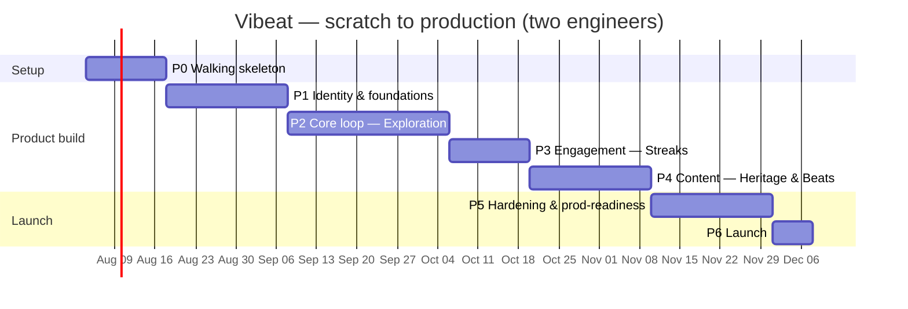

# Plans, Estimates, Schedules

The delivery plan that turns the [roadmap & backlog](roadmaps-and-backlogs.md) into a sequenced,
estimated schedule. This page holds the **two-engineer, scratch-to-production roadmap**.

## Team model

Two engineers, working **contract-first** and **trunk-based**:

| Role | Primary ownership | Also does |
|------|-------------------|-----------|
| **Engineer A — Backend-leaning** | Spring Boot modular monolith, Postgres, auth, events, API, CI/CD, infra | Contract design, backend tests |
| **Engineer B — Mobile-leaning** | React Native app, design system, map, screens, i18n | Contract review, mobile tests |

**Ways of working**
- The [OpenAPI](../01-product-documentation/01-core-specifications/api-system-specifications/rest-api.openapi.yaml)
  and [AsyncAPI](../01-product-documentation/01-core-specifications/api-system-specifications/domain-events.asyncapi.yaml)
  contracts are agreed **before** each feature — this lets A and B build in parallel (B works
  against generated mocks until A's endpoint lands).
- Every phase's "done" is defined by the matching
  [executable spec](../01-product-documentation/01-core-specifications/executable-specifications/)
  passing in CI, plus `ApplicationModules.verify()` staying green.
- Weekly sync to clear the **open product decisions** (below) before they block a phase.

## Estimate & assumptions

- **~18 weeks (~4.5 months)** from empty repos to production, for two engineers full-time.
- Assumes datasets exist (they do — the prototype's province data), design system exists
  (`DESIGN.md`), and infra is a managed container platform + managed Postgres.
- Timeline is **relative** (Week 1…18); the example calendar starts **2026-08-04** and can shift.

## Roadmap at a glance



## Phase 0 — Walking skeleton (Weeks 1–2)
**Goal:** both repos build, a trivial vertical slice runs in the **dev** environment, CI is green,
and module-boundary verification is wired from day one.

| Engineer A (backend) | Engineer B (mobile) |
|----------------------|---------------------|
| Gradle + Spring Boot (Java 25) project | React Native + TypeScript app scaffold |
| Spring Modulith with empty modules (`identity/exploration/engagement/content/shared`) + `ApplicationModules.verify()` test | Navigation shell (Auth stack + tab placeholders) |
| Postgres via Docker Compose + Flyway wiring; Actuator health | Design tokens from `DESIGN.md`; UI primitives (Button/Card/Input) |
| One trivial endpoint + springdoc OpenAPI; Dockerize | i18n scaffold (vi/en); theme switch; API client skeleton |
| CI: build → test → scan → image → deploy to dev | CI: typecheck → lint → test → build |

**Shared decisions:** Expo vs. bare RN (finish [ADR-0003](../01-product-documentation/02-authored-system-documentation/software-architecture-document/decisions/0003-react-native-for-mobile.md));
branch strategy; dev environment.
**Exit:** app calls the dev backend's health/ping; CI green both sides; `verify()` green; deployed to dev.

## Phase 1 — Identity & foundations (Weeks 3–5)
**Goal:** authentication end-to-end; Explorer + preferences; the event log proven; contract-first
flow validated on a real feature.
Spec: [`authentication.feature`](../01-product-documentation/01-core-specifications/executable-specifications/features/identity/authentication.feature).

| Engineer A | Engineer B |
|------------|------------|
| `identity` module: Explorer aggregate, preferences | Auth screens (welcome / sign-in / register) |
| OIDC auth: **Email + Google** first; JWT issue/refresh; Spring Security | OAuth flows (Email + Google); secure token storage |
| `ExplorerRegistered` / `PreferencesUpdated` events + Modulith JPA outbox | Profile & preferences screen; wire language/theme to preferences |
| Preferences endpoints; contract + module tests | React Query + Problem-Details error handling |

**Fast-follow:** Facebook + Zalo providers (can slip to P5).
**Exit:** sign in (Email+Google), set language/theme, persists across sessions; `@ready` auth
scenarios pass; first real contract + BDD tests in CI.

## Phase 2 — Core loop: Exploration (Weeks 6–9)
**Goal:** the heart of the product — map, province **unlocking**, collection.
Spec: [`province-unlocking.feature`](../01-product-documentation/01-core-specifications/executable-specifications/features/exploration/province-unlocking.feature).
**Prereq:** the **unlock condition** decision (see open decisions).

| Engineer A | Engineer B |
|------------|------------|
| Ingest canonical datasets into `exploration` schema | Port `<vn-map>` to an RN SVG map component |
| `Collection` aggregate + invariants; `UnlockProvince` | MapTab with provinces + unlocked (gold) fill |
| `ProvinceUnlocked` event; `ExplorerRegistered` listener | Province detail + unlock flow + celebratory animation (reduced-motion aware) |
| Endpoints: `/provinces`, `/provinces/{id}/unlock`, `/collection/me` | CollectionTab; offline cache basics |

**Exit:** unlock a province → gold fill + collection update, end-to-end green; `@ready` unlock
scenarios pass; map rendering performance acceptable.

## Phase 3 — Engagement: Streaks (Weeks 10–11)
**Goal:** daily **streak** & discovery ritual.
Spec: [`daily-streak.feature`](../01-product-documentation/01-core-specifications/executable-specifications/features/engagement/daily-streak.feature).
**Prereq:** **discovery ritual** definition + day/timezone rule.

| Engineer A | Engineer B |
|------------|------------|
| `engagement` module: `Streak` aggregate + invariants (once/day, reset, longest) | StreakTab UI + counter animation |
| `ProvinceUnlocked` listener; ritual-completion use case | Daily ritual prompt |
| `StreakAdvanced` / `StreakBroken`; `/streaks/me`; break evaluation + timezone | Basic milestone/reward surfaces |

**Exit:** streak advances once/day and breaks correctly (tested with clock control); `@ready`
streak scenarios pass.

## Phase 4 — Content: Heritage & Beats (Weeks 12–14)
**Goal:** the cultural payoff — heritage access, **Cultural Beats**, trivia.
Spec: [`heritage-access.feature`](../01-product-documentation/01-core-specifications/executable-specifications/features/content/heritage-access.feature).

| Engineer A | Engineer B |
|------------|------------|
| `content` module: RegionalHeritage / CulturalBeat / Trivia | Heritage screen; audio beat player |
| Access grant via `ProvinceUnlocked` listener; gating (403 when locked) | Trivia UI; gating UX (prompt to unlock) |
| Media: object storage + signed/CDN URLs; endpoints | Localized content rendering (VI/EN) |

**Shared:** seed real heritage content for a handful of launch provinces.
**Exit:** unlocked province shows playable beats + trivia in VI/EN; `@ready` content scenarios pass.

## Phase 5 — Hardening & production readiness (Weeks 15–17)
**Goal:** make it launch-grade. Driven by the
[Release Checklist](release-checklist.md).

- **Observability:** logs/metrics/traces, dashboards, alerts (incl. event-log backlog); Sentry on mobile.
- **Security:** review auth/secrets/rate-limiting; dependency + container scans clean.
- **Performance:** API + map load testing; DB indexing; caching.
- **Quality:** accessibility + VI/EN parity audit across all screens, both themes.
- **Auth completeness:** add Facebook + Zalo if deferred.
- **Ops:** staging cutover; blue/green deploy + **rollback rehearsal**; migration safety (expand/contract).
- **Store prep:** metadata, screenshots, privacy disclosures; TestFlight / Play **beta** + feedback loop.
- **Runbooks:** complete them; run an incident-response drill.

**Exit:** Release Checklist fully green; beta feedback addressed.

## Phase 6 — Launch (Week 18)
- Deploy backend to **production**; submit app to **App Store + Google Play** production.
- Hypercare: monitor dashboards, keep rollback ready.

**Exit:** live in production, healthy dashboards, rollback path verified.

## Critical path & dependencies
```
P0 skeleton → P1 identity (auth + events) → P2 exploration (unlock + ProvinceUnlocked)
   → P3 engagement (listens to ProvinceUnlocked) → P4 content (listens to ProvinceUnlocked) → P5 → P6
```
- **Identity is the gate** — everything needs an authenticated Explorer.
- **`ProvinceUnlocked`** is the backbone event; Engagement and Content both hang off it, so P2's
  event contract must be right before P3/P4.
- Engineer B can stay ~½ phase ahead of Engineer A by building against **generated mocks** from
  the agreed OpenAPI, integrating when the real endpoint lands.

## Open product decisions (resolve before the phase that needs them)
| Decision | Needed by | Owner |
|----------|-----------|-------|
| **Unlock condition** (proximity / trivia / tap / purchase) | Phase 2 | Product |
| **Discovery ritual** definition + day/timezone rule | Phase 3 | Product |
| **Account linking** across providers | Phase 5 (can defer) | Product |
| Expo vs. bare React Native | Phase 0 | Eng |
| Hosting platform + observability stack | Phase 5 | Eng |

## Risks & mitigations
| Risk | Impact | Mitigation |
|------|--------|-----------|
| Product decisions slip | Blocks P2/P3 | Decide in Week-by-week sync; keep `@draft` scenarios explicit |
| Map performance on low-end devices | UX | Prototype early in P2; profile; virtualize/simplify SVG |
| OAuth provider integration (esp. Zalo) friction | Auth delay | Start with Email+Google in P1; treat Facebook/Zalo as fast-follow |
| App-store review delays | Launch date | Enter TestFlight/Play beta in P5, not P6; keep API `/v1` backward-compatible |
| Two-person bus factor | Continuity | Contract-first + docs-as-source-of-truth; both cross-train on the other stack |

## Milestone summary
| Milestone | Phase | Exit criteria |
|-----------|-------|---------------|
| **M0 Foundations** | P0 | Skeleton runs in dev; CI green; `verify()` green |
| **M1 Core loop** | P1–P2 | Auth + unlocking + collection specs pass |
| **M2 Engagement** | P3 | Streak specs pass |
| **M3 Content** | P4 | Heritage/beats/trivia specs pass |
| **M4 Launch-ready** | P5 | Release Checklist green; beta validated |
| **Production** | P6 | Live on App Store + Play; healthy |
