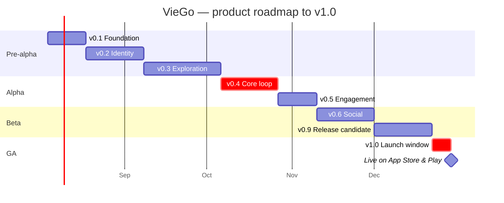

# Product Roadmap & Backlog

The **high-level product view**: which capability lands in which **version**, roughly when, and to
whom. It answers *"what is VieGo at v0.4, and when do we get there?"*

> **Zoom in:** each release below is delivered by one **phase**, and every phase is planned in
> detail — sprint goal, owners, week-by-week schedule, and the smaller specs it decomposes into —
> in [Plans, Estimates, Schedules](plans-estimates-schedules.md). This page is the map; that page
> is the itinerary.

## Release train

One version per phase. Dates are **relative** (Week 1…21); the example calendar starts
**2026-08-04** and shifts as a block if the start moves.

| Version | Release theme | Phase | Target (rel.) | Example date | Audience | Headline capability |
|---------|---------------|-------|---------------|--------------|----------|---------------------|
| **v0.1** | Foundation | P0 | end of W2 | 2026-08-17 | Internal / dev | Walking skeleton: monorepo builds, app talks to the deployed dev backend, CI green |
| **v0.2** | Identity | P1 | end of W5 | 2026-09-07 | Internal / dev | Sign in (Email + Google), handle, language & theme preferences |
| **v0.3** | Exploration | P2 | end of W9 | 2026-10-05 | Internal / dev | Map of Vietnam, provinces & places, search, collection, unlock listener |
| **v0.4** | Core loop | P3 | end of W12 | 2026-10-26 | **Internal alpha** (dogfood) | **Capture a Beat** → province unlocks → memories. The product is usable end to end |
| **v0.5** | Engagement | P4 | end of W14 | 2026-11-09 | Internal alpha | Daily streak, milestones & badges, notifications feed |
| **v0.6** | Social | P5 | end of W17 | 2026-11-30 | **Closed beta** (invite) | Friends & invite links, friend feed, Discover, reactions |
| **v0.9** | Release candidate | P6 | end of W20 | 2026-12-21 | **TestFlight / Play beta** | Feature-complete + hardened: observability, security, performance, a11y, store assets |
| **v1.0** | Public launch | P7 | end of W21 | 2026-12-28 | **Public — App Store + Google Play** | GA on both stores with hypercare and a verified rollback path |

**Release gates** — a version ships only when its phase's
[executable specs](../01-product-documentation/01-core-specifications/executable-specifications/)
are green in CI and `ApplicationModules.verify()` passes. From **v0.9** onward the
[Release Checklist](release-checklist.md) is the gate.

## Roadmap themes

| Horizon | Versions | Focus |
|---------|----------|-------|
| **Now** | v0.1 → v0.4 | Foundations + the core loop: authentication, map & places, **capture a Beat** → unlock + memories |
| **Next** | v0.5 → v1.0 | Engagement: daily streaks & milestones · Social: friends, feeds, Discover, reactions · then hardening & launch |
| **Later** | v1.x | Richer notifications, offline capture queue, more languages, place bookmarks/reviews depth |

## Backlog (feature specs)

Each item becomes an [executable spec](../01-product-documentation/01-core-specifications/executable-specifications/)
plus the API/system contract before build. **Target** is the version the item is committed to;
items are pulled into a phase by the [delivery plan](plans-estimates-schedules.md).

| Item | Context | Target | Status |
|------|---------|--------|--------|
| Authentication (Email/Google) + handle | Identity | v0.2 | draft |
| Language & theme preferences | Identity | v0.2 | draft |
| Map, places (POIs), search | Exploration | v0.3 | draft |
| Province unlocking (via first capture) | Exploration | v0.3 | draft |
| Collection view | Exploration | v0.3 | draft |
| **Beat capture** (photo, audience, memories) | Content | **v0.4** | draft |
| Daily capture streak & milestones/badges | Engagement | v0.5 | draft |
| Notifications (delivery sink) | Notification | v0.5 | draft |
| Friends, invite links, friend feed & Discover | Social | v0.6 | draft |
| Reactions (like/bolt) | Social | v0.6 | draft |
| Authentication — Facebook + Zalo providers | Identity | v0.6 (fast-follow) | draft |
| Reviews (verified by location) | Content | v1.x | backlog |
| Offline capture queue | Content | v1.x | backlog |
| Place bookmarks & review depth | Exploration | v1.x | backlog |
| Additional languages beyond VI/EN | Identity | v1.x | backlog |

## Post-1.0 (v1.x)

Not date-committed — sequenced by beta and launch feedback. Candidates: verified reviews with
moderation, an offline capture queue for weak-signal travel, richer/segmented notifications,
place bookmarks, and additional languages.

## Open product decisions (block "ready")

| Decision | Blocks | Owner |
|----------|--------|-------|
| **Day/timezone rule** for the streak day boundary | v0.5 | Product |
| **Review** eligibility + moderation | v1.x (scoped out of v0.4) | Product |
| **Friend-request vs. auto-accept** on invite links | v0.6 | Product |
| **Account linking** across providers | v0.6 (can defer) | Product |

> **Resolved from the prototype:** unlock = capture your first Beat in the province; the daily ritual
> = capturing a Beat.

> Keep this in sync with the [delivery plan](plans-estimates-schedules.md), the executable specs,
> and the API/system specifications.
