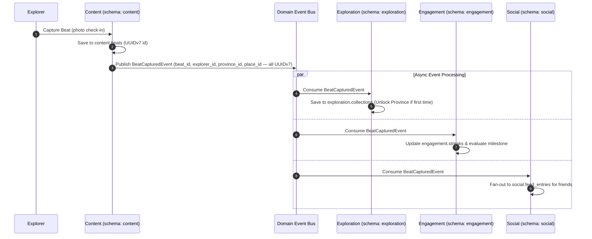

# Database Schema Architecture & ER Diagram

**Feature**: Modular Database Schemas per Backend Context
**Branch**: `003-modular-database-schemas`
**Date**: 2026-07-23

## High-Level Schema Architecture & Keys

```mermaid
erDiagram
    %% Identity Schema (Security UUIDv7/v4 - 16 Bytes)
    IDENTITY_EXPLORERS {
        uuid id PK "16 Bytes (Security)"
        string handle UK
        string display_name
        string status
    }
    IDENTITY_AUTH_PROVIDERS {
        uuid id PK "16 Bytes"
        uuid explorer_id FK
        string provider_kind
        string provider_subject_id
    }
    IDENTITY_PREFERENCES {
        uuid explorer_id PK
        string language
        string theme
    }

    %% Exploration Schema (natural ISO keys for geography, UUIDv7 elsewhere)
    EXPLORATION_PROVINCES {
        string id PK "ISO Code (e.g. VN-HN)"
        string name_vi
        string name_en
    }
    EXPLORATION_PLACES {
        uuid id PK "UUIDv7"
        string province_id FK
        string name
        string category
    }
    EXPLORATION_COLLECTIONS {
        uuid id PK "UUIDv7"
        uuid explorer_id "Logical Ref (Identity UUID)"
        string province_id FK
    }

    %% Content Schema (UUIDv7)
    CONTENT_BEATS {
        uuid id PK "UUIDv7"
        uuid explorer_id "Logical Ref (Identity UUID)"
        uuid place_id "Logical Ref (Exploration)"
        string province_id "Logical Ref (Exploration ISO)"
        string media_url
    }
    CONTENT_REVIEWS {
        uuid id PK "UUIDv7"
        uuid explorer_id "Logical Ref (Identity UUID)"
        uuid place_id "Logical Ref (Exploration)"
        uuid beat_id FK
    }

    %% Engagement Schema (UUIDv7)
    ENGAGEMENT_STREAKS {
        uuid explorer_id PK "Logical Ref (Identity UUID)"
        int current_streak
        int longest_streak
    }
    ENGAGEMENT_NOTIFICATIONS {
        uuid id PK "UUIDv7"
        uuid recipient_id "Logical Ref (Identity UUID)"
        string kind
    }

    %% Social Schema (UUIDv7)
    SOCIAL_FRIENDSHIPS {
        uuid id PK "UUIDv7"
        uuid explorer_id "Logical Ref (Identity UUID)"
        uuid friend_id "Logical Ref (Identity UUID)"
    }
    SOCIAL_FEED_ENTRIES {
        uuid id PK "UUIDv7"
        uuid subscriber_id "Logical Ref (Identity UUID)"
        uuid beat_id "Logical Ref (Content)"
        uuid author_id "Logical Ref (Identity UUID)"
    }

    IDENTITY_EXPLORERS ||--o{ IDENTITY_AUTH_PROVIDERS : "has"
    IDENTITY_EXPLORERS ||--|| IDENTITY_PREFERENCES : "has"
    EXPLORATION_PROVINCES ||--o{ EXPLORATION_PLACES : "contains"
    EXPLORATION_PROVINCES ||--o{ EXPLORATION_COLLECTIONS : "unlocked in"
    CONTENT_BEATS ||--o{ CONTENT_REVIEWS : "verifies"
```

## Cross-Schema Integration Contract

As detailed above, NO foreign key constraints cross the border between schemas. All cross-context interactions are driven by Domain Events published via Spring Modulith:

